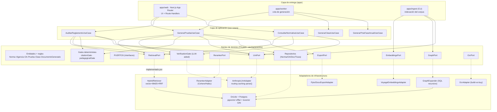
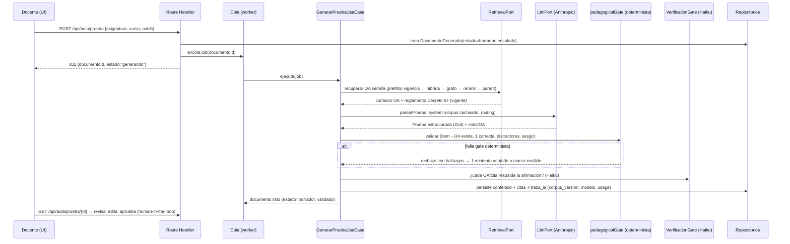

# Blueprint de Arquitectura de Producción — Faro

> **⚠️ Alcance vigente v2 (2026-06-07):** este blueprint describe el producto **v1 (normativo)**. En Faro **v2**, lo **vigente** es: monorepo hexagonal, persistencia, **worker asíncrono** (ADR-003), **corpus versionado** (ADR-004), export y HIL. Está **aparcado** (fuera de alcance v2): grafo normativo, **RAG/pgvector** (ADR-001), reranker, Decreto 67/83 como motor, gates legales y los módulos PME/PACI/normativo. La fuente de verdad del build v2 es `specs/` + `CLAUDE.md`. Ver `specs/README.md` §0.
>
> **Estado:** Propuesta para revisión de comité técnico · **Versión:** 1.0 · **Fecha:** 2026-06-05
> **Filosofía rectora:** Ports & Adapters (arquitectura hexagonal). El dominio —grafo normativo, currículum/OA, generación, verificación— es independiente de frameworks; las integraciones externas (Voyage, reranker, OCR, export `.pptx`/`.docx`) son adaptadores reemplazables tras interfaces estables, **no** placeholders desechables.
> **Construcción:** por *vertical slices* de calidad de producción. La "Fase 0" es *cimientos de producción + primer slice real end-to-end* (generador de pruebas de Aula con corpus OA mínimo real), no un esqueleto con stubs.
>
> **Fuentes de verdad:** `docs/solucion-educacion.md`, `docs/plan-implementacion-faro.md`, `docs/adr-001-recuperacion-rag.md`. Este documento las consolida en una arquitectura ejecutable y propone ajustes fundamentados (marcados como *candidato a ADR*).

---

## 0. Resumen ejecutivo (para el comité)

Faro es un **encargado de tratamiento** (procesador) que produce documentos pedagógicos y de cumplimiento regulado para colegios chilenos, con corrección de nivel legal. El valor defendible (el foso) **no es el LLM** sino dos *knowledge graphs* curados (normativa MINEDUC con vigencias; currículum nacional / OA) y la lógica de workflow regulado.

La decisión arquitectónica central: **aislar el dominio detrás de puertos** para que (a) la corrección legal (vigencias, citas, grounding) se pueda *testear de forma determinista*, (b) los proveedores externos (embeddings legales, reranker, OCR, export) sean *intercambiables* sin tocar la lógica de negocio, y (c) los gates de cumplimiento (Art. 8 bis, Ley 21.719) sean *invariantes de arquitectura*, no convenciones.

Tres ajustes que recomiendo al plan/ADR actuales, con fundamento (detalle en §3):

1. **Monorepo pnpm con paquetes de dominio puros** en vez de "app única modular". El dominio regulado debe poder compilar y testearse sin Next.js. Bajo costo ahora, evita un refactor doloroso al escalar a worker de ingesta + SLEP multi-tenant. *(candidato a ADR-002)*
2. **Generación en un worker/cola, no en el request HTTP de Next.js.** La generación es de 10–60 s (rerank + verificación + thinking adaptivo). Correrla en un Route Handler arriesga timeouts y mata la observabilidad de costos. *(candidato a ADR-003)*
3. **Corpus versionado como entidad de primera clase** (`corpus_version`), no solo `vigencia_desde/hasta` por norma. Permite re-indexar, hacer rollback y *atar cada `traza_ia` a la versión exacta del corpus que vio* — esto es defensibilidad legal pura. *(candidato a ADR-004)*

Drizzle y el stack del plan §0 se **mantienen** (no recomiendo Prisma; ver §3.4).

---

## 1. Contexto y principios de arquitectura

### 1.1 Boundaries (qué es dominio vs infraestructura)

| Capa | Contiene | NO conoce | Regla |
|---|---|---|---|
| **Dominio** (`packages/domain`) | Entidades y reglas: `Norma`, `Vigencia`, `ObjetivoAprendizaje`, `Prueba`, `Clase`, `DocumentoGenerado`; lógica de citas, alineación OA→ítem, cobertura Decreto 67; *puertos* (interfaces) | TypeScript SDK de Anthropic, Drizzle, Next.js, Voyage, Postgres, HTTP | TS puro. Cero `import` de framework. Cero I/O. |
| **Aplicación** (`packages/application`) | *Use cases* / orquestadores: `GenerarPruebaUseCase`, `AuditarReglamentoUseCase`, `ConsultarNormativaUseCase`. Componen puertos; transacciones; emiten `traza_ia` | Detalles de frameworks concretos | Depende solo de `domain` (puertos). |
| **Infraestructura** (`packages/infra-*`) | *Adapters*: `DrizzleNormaRepository`, `VoyageEmbeddingsAdapter`, `AnthropicLlmAdapter`, `CohereRerankerAdapter`, `PptxExportAdapter`, `OcrAdapter` | Reglas de negocio | Implementa puertos del dominio. Reemplazable. |
| **Entrega** (`apps/web`, `apps/worker`) | Next.js (UI + API), worker de cola, CLI de ingesta. Composition root (DI) | — | Cablea adapters a use cases. Fina. |

**Regla de dependencia (la única que importa):** las flechas de `import` apuntan **siempre hacia el dominio**. `infra` y `apps` dependen de `application` y `domain`; nunca al revés. Se enforza con ESLint (`no-restricted-imports` + boundaries) y con la propia separación de paquetes (un paquete no puede importar lo que no declara en `package.json`).

### 1.2 Principios

1. **El dominio regulado es testeable sin red.** Vigencias, validez de citas (existe+vigente), una-sola-correcta, ítem→OA: todo eso es *determinista* y vive en `domain`, con tests sin DB ni LLM.
2. **Los proveedores externos son detalles.** Voyage, reranker, OCR, export `.pptx` son *adapters* tras puertos. Cambiar `voyage-law-2` por otro embedding es cambiar un adapter + reindexar, no tocar el orquestador.
3. **El LLM es no determinista; el grounding es la frontera.** Todo lo que sale del LLM pasa por gates deterministas antes de poder cambiar de estado. El LLM nunca decide; propone borradores (Art. 8 bis).
4. **Cumplimiento by-design, no by-convention.** `borrador` es el estado inicial *forzado por tipo* (ver §9.4). No existe un camino de código que cree un documento `aprobado` sin revisor humano.
5. **Claridad sobre cleverness; sin `any`; comentar el *por qué*.** (Convenciones del dueño, CLAUDE.md global.)

---

## 2. Vista de componentes

### 2.1 Diagrama de componentes (ports & adapters)



### 2.2 Flujo de una generación de punta a punta (Aula — pruebas)



---

## 3. Decisiones técnicas con trade-offs (y crítica constructiva del plan/ADR)

> Se mantiene el stack no negociable del plan §0 (pnpm, Next.js App Router + React + TS `strict`, Postgres + pgvector + tsvector, Drizzle, SDK Anthropic, Zod + `zodOutputFormat`, Vitest, ESLint/Prettier, CI GitHub Actions, docker-compose). Las decisiones nuevas se marcan **candidato a ADR**.

### 3.1 Verificación de hechos del stack de IA (corrige el plan)

Confirmado vía la referencia `claude-api` (cache 2026-05-26). **Una corrección al plan**:

- **Mínimo cacheable de prompt:** el plan §0 dice "4096 en Opus/Haiku, 2048 en Sonnet 4.6". **Correcto** — lo confirmo y lo fijo como invariante de diseño del prefijo cacheado (ver §7.3). Por debajo no cachea *en silencio* (`cache_creation_input_tokens: 0`).
- **IDs exactos** (sin sufijo de fecha): `claude-opus-4-8` ($5/$25, 1M ctx, 128K out), `claude-sonnet-4-6` ($3/$15, 1M ctx, 64K out), `claude-haiku-4-5` ($1/$5, 200K ctx, 64K out).
- **`thinking: {type:"adaptive"}`** — `budget_tokens` da 400 en Opus 4.8. Correcto en el plan.
- **`output_config:{effort:...}`**: `max` es **solo Opus-tier**; Sonnet/Haiku dan error con `max`. → El router debe *capar* `effort` por modelo (ver §7.1).
- **Structured outputs:** `messages.parse()` + `zodOutputFormat(schema)` soportado en los tres modelos; `parsed_output` puede ser `null` (refusal/max_tokens) → manejar siempre. Limitaciones del schema: sin recursión, sin `minLength/maximum/minimum`; el SDK los valida client-side. **Implicación de diseño:** los schemas Zod del plan §3 que usan constraints numéricos deben validarse en el `pedagogicalGate` determinista, no confiar en el schema.
- **Opus 4.8 narra más y pregunta más** que 4.7. Para los flujos de Faro (salida estructurada, no chat agéntico largo) esto es marginal, pero el system prompt debe pedir "solo el artefacto, sin preámbulo".

### 3.2 *(candidato a ADR-002)* Monorepo pnpm con paquetes de dominio — en vez de "app única modular"

**Crítica al plan/scaffolding:** el `prompt-scaffolding-faro.md` propone una "app única, modular" (`src/lib/...`, `src/modules/...`). Funciona para arrancar, pero acopla el dominio regulado a Next.js: el dominio no puede compilar ni testearse sin el framework, y al añadir el **worker de generación** (§3.3) y la **CLI de ingesta** terminas duplicando o importando a través de Next.

**Decisión propuesta:** monorepo pnpm workspaces:

```
packages/domain         → TS puro, cero deps de framework
packages/application    → use cases, depende de domain
packages/infra-db       → Drizzle adapters
packages/infra-ai       → Anthropic, Voyage, reranker
packages/infra-export   → pptx/docx/pdf
apps/web                → Next.js (UI + API)
apps/worker             → consumidor de cola
apps/ingest             → CLI de indexación del corpus
```

**Trade-off:** más ceremonia inicial (tsconfig references, project graph). A cambio: el foso (dominio) es portable, testeable en aislamiento, y el límite de capas es *físico* (no se puede importar lo que no está en `package.json`). Dado que el plan prioriza **robustez sobre velocidad**, el costo se justifica. No es over-engineering: son ~6 paquetes con fronteras claras, no microservicios.

### 3.3 *(candidato a ADR-003)* Generación asíncrona en worker — no en el Route Handler

**Crítica al plan/ADR:** el ADR-001 prioriza robustez (rerank + verificación + *belt-and-suspenders* full-context). Eso implica latencias de 10–60 s por documento. Correr eso síncrono en un Route Handler de Next.js (a) arriesga timeouts de plataforma (Vercel/Node), (b) bloquea el request, (c) dificulta reintentos idempotentes y observabilidad de costos.

**Decisión propuesta:** patrón *command → queue → worker → poll/SSE*.
- El Route Handler **crea** el `DocumentoGenerado` en estado `borrador`/`encolado` y devuelve `202 {documentoId}`.
- Un worker (`apps/worker`) consume la cola, ejecuta el use case completo, persiste resultado + `traza_ia`.
- La UI hace *polling* (o SSE) sobre el `documentoId`.

**Cola para el MVP:** tabla Postgres `job_generacion` con `SELECT ... FOR UPDATE SKIP LOCKED` (sin nueva dependencia de infra; transaccional con el dominio). Migrar a un broker dedicado solo si el volumen lo exige. *(El chat normativo M3, que sí es interactivo y corto, puede ir síncrono con streaming — es la excepción.)*

**Trade-off:** más piezas (worker + cola). A cambio: sin timeouts, reintentos seguros, costos atribuibles por job, y el camino natural a multi-tenant SLEP.

### 3.4 Drizzle vs Prisma — se mantiene **Drizzle**

El plan deja "Drizzle o Prisma (elegir uno)". **Recomiendo Drizzle**, fundadamente:
- **pgvector + tsvector:** Faro necesita SQL crudo y controlado (operadores `<=>`, `ts_rank_cd`, CTEs recursivas para el grafo, RRF). Drizzle expone SQL tipado (`sql\`\``) sin pelear con el ORM; Prisma históricamente abstrae de más y `pgvector`/full-text terminan en `$queryRaw`, perdiendo el tipado que era la ventaja.
- **TS-first, sin capa de generación opaca:** menos cleverness, más claridad (convención del dueño).
- **Migraciones versionadas** (`drizzle-kit`) encajan con el requisito de corpus versionado (§5.7).

Prisma ganaría en *DX de modelado relacional puro*, que no es el cuello de botella de Faro.

### 3.5 Estructura del corpus — *(candidato a ADR-004)*

**Crítica al plan/ADR:** el modelo actual usa `vigencia_desde/hasta` por `norma`. Es necesario pero insuficiente para *defensibilidad*: cuando re-indexas (nuevo embedding, re-chunking, corrección curatorial), no puedes responder "¿qué texto exacto vio el modelo cuando generó este documento en marzo?". Eso es exactamente lo que un fiscalizador o un litigio pediría.

**Decisión propuesta:** entidad `corpus_version` (snapshot inmutable de la ingesta) + `traza_ia.corpus_version_id`. Cada `chunk_norma`/`chunk_oa` referencia su `corpus_version`. La recuperación filtra por `corpus_version` "publicada" actual; la traza congela cuál se usó. Esto, sumado a vigencias, da *reproducibilidad legal*.

### 3.6 Chunking + parent-document — sin tabla separada de chunks

El ADR pide chunking estructural (ley→art→inciso→letra) y *parent-document retrieval*. **Decisión de modelado:** `norma` es la unidad citable *padre*; `chunk_norma` son las unidades indexables hijas (con `embedding` y `tsv`). Recuperas por chunk, devuelves el padre. Evita el anti-patrón de "ventanas fijas" y mantiene la `referencia` canónica en el padre.

### 3.7 Resumen de candidatos a ADR

| ADR | Título | Decisión en una línea |
|---|---|---|
| ADR-002 | Monorepo pnpm con paquetes de dominio puros | El dominio regulado vive en paquetes sin framework; capas con frontera física. |
| ADR-003 | Generación asíncrona vía cola + worker | La generación corre fuera del request HTTP; cola Postgres `SKIP LOCKED` en MVP. |
| ADR-004 | Corpus versionado como entidad | `corpus_version` inmutable + `traza_ia.corpus_version_id` para reproducibilidad legal. |
| ADR-005 | Routing de modelos como puerto con política capada por modelo | `effort:max` solo Opus; degradación clara sin API key. |
| ADR-006 | Gates como invariantes (determinista vs LLM) | citationGate y pedagogicalGate: parte determinista bloqueante; parte LLM advisory verificada. |
| ADR-007 | Multi-tenancy y aislamiento de datos por establecimiento | RLS Postgres + `establecimiento_id` en todo dato del colegio (preparado para SLEP). |

---

## 4. Estructura de repositorio definitiva

```
faro/
├── pnpm-workspace.yaml
├── package.json                      # scripts raíz (turbo/pnpm -r)
├── tsconfig.base.json                # strict:true, noUncheckedIndexedAccess
├── docker-compose.yml                # postgres + pgvector
├── drizzle.config.ts
├── .env.example
├── .github/workflows/ci.yml
├── eslint.config.js                  # boundaries entre capas
│
├── packages/
│   ├── domain/                       # ── NÚCLEO · TS puro, sin frameworks ──
│   │   ├── src/
│   │   │   ├── entities/             # Norma, Vigencia, ObjetivoAprendizaje,
│   │   │   │                         #   Prueba, Clase, DocumentoGenerado, Cita
│   │   │   ├── value-objects/        # ReferenciaCanonica, RangoVigencia, OaId
│   │   │   ├── ports/                # RetrievalPort, EmbeddingsPort, RerankerPort,
│   │   │   │                         #   GraphPort, LlmPort, VerificationGate,
│   │   │   │                         #   *Repository, ExportPort, OcrPort, ClockPort
│   │   │   ├── gates/                # citationGate.ts, pedagogicalGate.ts (determinista)
│   │   │   ├── schemas/              # Zod: prueba, clase, pmeAccion, reglamentoAuditoria
│   │   │   └── errors/               # GeneracionError, GroundingError, GateError
│   │   └── package.json              # SIN deps de framework
│   │
│   ├── application/                  # ── USE CASES ──
│   │   ├── src/
│   │   │   ├── aula/                 # GenerarPruebaUseCase, GenerarClaseUseCase
│   │   │   ├── normativo/            # ConsultarNormativaUseCase, AuditarReglamentoUseCase
│   │   │   ├── pme/                  # GenerarPmeFaseAnualUseCase
│   │   │   └── shared/               # pipeline RAG compuesto, política de routing
│   │   └── package.json              # depende SOLO de domain
│   │
│   ├── infra-db/                     # Drizzle adapters
│   │   ├── src/schema/               # norma, chunk_norma, oa, chunk_oa, relaciones,
│   │   │                             #   establecimiento, documento_generado, traza_ia,
│   │   │                             #   corpus_version, job_generacion, usuario, consentimiento
│   │   ├── src/repositories/         # implementaciones de *Repository
│   │   ├── src/retrieval/            # HybridRetriever (vector+BM25+RRF), GraphExpander
│   │   ├── migrations/
│   │   └── seed/                     # corpus mínimo real (OA + Decreto 67)
│   │
│   ├── infra-ai/
│   │   ├── src/anthropic/            # AnthropicLlmAdapter, router, cache, usageLogger
│   │   ├── src/voyage/               # VoyageEmbeddingsAdapter (+ fake para tests)
│   │   └── src/rerank/               # RerankerAdapter (Cohere | Haiku fallback)
│   │
│   ├── infra-export/                 # PptxExportAdapter, DocxExportAdapter, PdfExportAdapter
│   ├── infra-ocr/                    # OcrAdapter (proveedor comprado) + fake
│   ├── observability/                # logger estructurado, métricas de tokens/costos, tracing
│   └── config/                       # carga/validación de env (Zod), secretos
│
├── apps/
│   ├── web/                          # Next.js App Router
│   │   ├── app/
│   │   │   ├── (auth)/               # login, RBAC
│   │   │   ├── api/
│   │   │   │   ├── health/route.ts
│   │   │   │   ├── aula/prueba/route.ts      # POST → encola; GET → estado
│   │   │   │   ├── normativo/chat/route.ts   # síncrono + streaming (excepción)
│   │   │   │   └── reglamento/auditar/route.ts
│   │   │   ├── aula/ pme/ normativo/         # UI por módulo
│   │   │   └── revision/                     # cola de revisión humana (HIL)
│   │   └── lib/composition-root.ts   # DI: cablea adapters → use cases
│   │
│   ├── worker/                       # consumidor de job_generacion
│   └── ingest/                       # CLI: chunking, embeddings, índices, corpus_version
│
├── evals/                            # harness de evals (golden sets versionados)
│   ├── datasets/                     # recall@k, fidelidad citas, alineación OA, Decreto 67
│   ├── runners/                      # corre evals, reporta métricas
│   └── thresholds.json               # umbrales que fallan el build
│
└── docs/                             # solucion-educacion, plan, ADRs, este blueprint
```

**Reglas de límites (enforzadas):**
- `domain` no importa nada de `application`, `infra-*`, `apps/*`, ni de ningún SDK. Lint: `no-restricted-imports` bloquea `@anthropic-ai/*`, `drizzle*`, `next*` dentro de `packages/domain`.
- `application` solo importa `domain`.
- `infra-*` importa `domain` (para implementar puertos) y `application` solo si expone use cases; nunca `apps/*`.
- `apps/*` es el único lugar con la *composition root*.

---

## 5. Modelo de datos final

> DDL de referencia (Postgres + pgvector). Drizzle como ORM. Dimensión de embedding **fijada por `corpus_version`** (no hardcodeada): `voyage-law-2` produce 1024 dims `[VERIFICAR: confirmar dim exacta de voyage-law-2 antes de fijar el índice]`. El plan usaba `vector(1536)`; lo dejo parametrizado por versión de corpus para no atarse a un proveedor.

### 5.1 Corpus versionado (foso + reproducibilidad)

```sql
-- Snapshot inmutable de una ingesta del corpus (normativa + currículum).
CREATE TABLE corpus_version (
  id              uuid PRIMARY KEY DEFAULT gen_random_uuid(),
  etiqueta        text NOT NULL,              -- 'normativa-2026-06', 'oa-mat-2026-06'
  embedding_model text NOT NULL,              -- 'voyage-law-2'
  embedding_dim   int  NOT NULL,              -- p.ej. 1024
  estado          text NOT NULL DEFAULT 'borrador', -- borrador | publicada | retirada
  created_at      timestamptz NOT NULL DEFAULT now(),
  publicada_at    timestamptz
);
```

### 5.2 Normativa (grafo) + chunks indexables

```sql
-- Unidad citable PADRE (parent-document). 'cuerpo' es el texto canónico citable.
CREATE TABLE norma (
  id              uuid PRIMARY KEY DEFAULT gen_random_uuid(),
  corpus_version_id uuid NOT NULL REFERENCES corpus_version(id),
  tipo            text NOT NULL,             -- ley | decreto | plan | orientacion
  referencia      text NOT NULL,             -- 'Decreto 67/2018 art. 18 lit. f' (canónica)
  titulo          text NOT NULL,
  cuerpo          text NOT NULL,
  vigencia_desde  date,
  vigencia_hasta  date,                       -- NULL = vigente
  estado_vigencia text NOT NULL DEFAULT 'vigente', -- vigente | derogado | modificado
  metadata        jsonb NOT NULL DEFAULT '{}'::jsonb
);

-- Unidad indexable HIJA (chunk estructural). Se recupera el chunk, se devuelve el padre.
CREATE TABLE chunk_norma (
  id              uuid PRIMARY KEY DEFAULT gen_random_uuid(),
  norma_id        uuid NOT NULL REFERENCES norma(id) ON DELETE CASCADE,
  corpus_version_id uuid NOT NULL REFERENCES corpus_version(id),
  texto           text NOT NULL,
  embedding       vector(1024) NOT NULL,      -- dim según corpus_version
  tsv             tsvector GENERATED ALWAYS AS (to_tsvector('spanish', texto)) STORED
);

-- Índices del ADR-001: vector (ivfflat) + léxico (GIN). Filtrados por vigencia/version.
CREATE INDEX idx_chunk_norma_embed ON chunk_norma USING ivfflat (embedding vector_cosine_ops) WITH (lists = 100);
CREATE INDEX idx_chunk_norma_tsv   ON chunk_norma USING gin (tsv);
CREATE INDEX idx_norma_vigencia    ON norma (corpus_version_id, estado_vigencia, vigencia_hasta);

-- Relaciones del grafo (multi-hop GraphRAG).
CREATE TABLE norma_relacion (
  origen_id  uuid NOT NULL REFERENCES norma(id),
  destino_id uuid NOT NULL REFERENCES norma(id),
  tipo       text NOT NULL,                  -- consolida_en_pme | deroga | modifica | requiere
  PRIMARY KEY (origen_id, destino_id, tipo)
);
```

### 5.3 Currículum nacional (OA) — mismo patrón de recuperación

```sql
CREATE TABLE objetivo_aprendizaje (
  id              uuid PRIMARY KEY DEFAULT gen_random_uuid(),
  corpus_version_id uuid NOT NULL REFERENCES corpus_version(id),
  codigo          text NOT NULL,             -- 'MA06 OA 02' (citable)
  asignatura      text NOT NULL,
  nivel           text NOT NULL,             -- '6º básico'
  descripcion     text NOT NULL,
  indicadores     jsonb NOT NULL DEFAULT '[]'::jsonb,
  vigencia_desde  date,
  vigencia_hasta  date
);
CREATE TABLE chunk_oa (
  id        uuid PRIMARY KEY DEFAULT gen_random_uuid(),
  oa_id     uuid NOT NULL REFERENCES objetivo_aprendizaje(id) ON DELETE CASCADE,
  corpus_version_id uuid NOT NULL REFERENCES corpus_version(id),
  texto     text NOT NULL,
  embedding vector(1024) NOT NULL,
  tsv       tsvector GENERATED ALWAYS AS (to_tsvector('spanish', texto)) STORED
);
CREATE INDEX idx_chunk_oa_embed ON chunk_oa USING ivfflat (embedding vector_cosine_ops) WITH (lists = 100);
CREATE INDEX idx_chunk_oa_tsv   ON chunk_oa USING gin (tsv);
```

### 5.4 Establecimiento + multi-tenancy

```sql
CREATE TABLE establecimiento (
  id           uuid PRIMARY KEY DEFAULT gen_random_uuid(),
  rbd          text UNIQUE NOT NULL,
  nombre       text NOT NULL,
  dependencia  text NOT NULL,                -- municipal | slep | part_subv | part_pagado
  slep_id      uuid,                          -- preparado para contrato multi-establecimiento
  convenio_sep boolean NOT NULL DEFAULT false,
  reglamento_evaluacion jsonb                 -- reglamento Decreto 67 del colegio (para Aula/auditoría)
);
```

### 5.5 Documentos generados + estado HIL + citas

```sql
CREATE TABLE documento_generado (
  id                uuid PRIMARY KEY DEFAULT gen_random_uuid(),
  establecimiento_id uuid NOT NULL REFERENCES establecimiento(id),
  tipo              text NOT NULL,            -- prueba | clase | reglamento_auditoria | pme_fase_anual
  contenido         jsonb NOT NULL,           -- validado por JSON Schema (Zod)
  citas             jsonb NOT NULL DEFAULT '[]'::jsonb,  -- [{norma_id|oa_id, referencia}]
  estado_revision   text NOT NULL DEFAULT 'borrador',    -- borrador | en_revision | aprobado | rechazado
  estado_generacion text NOT NULL DEFAULT 'encolado',    -- encolado | generando | validado | fallido
  autor_humano      uuid REFERENCES usuario(id),         -- quien revisó/aprobó (HIL)
  resultado_gates   jsonb,                                -- hallazgos de citationGate/pedagogicalGate
  created_at        timestamptz NOT NULL DEFAULT now(),
  aprobado_at       timestamptz,
  -- Invariante de cumplimiento (Art. 8 bis): no hay 'aprobado' sin revisor humano.
  CONSTRAINT chk_aprobado_requiere_humano
    CHECK (estado_revision <> 'aprobado' OR autor_humano IS NOT NULL)
);
```

### 5.6 Auditoría de IA (`traza_ia`) — Art. 8 bis + reproducibilidad

```sql
CREATE TABLE traza_ia (
  id                uuid PRIMARY KEY DEFAULT gen_random_uuid(),
  documento_id      uuid NOT NULL REFERENCES documento_generado(id),
  corpus_version_id uuid NOT NULL REFERENCES corpus_version(id),  -- qué corpus vio el modelo
  modelo            text NOT NULL,            -- claude-opus-4-8 | sonnet-4-6 | haiku-4-5
  ruta_decision     text NOT NULL,            -- por qué se ruteó a ese modelo
  prompt_hash       text NOT NULL,
  recuperado        jsonb NOT NULL,           -- IDs y rerank-scores de lo recuperado (auditable)
  citas             jsonb NOT NULL,
  evals             jsonb,                    -- resultado de gates en esta generación
  usage             jsonb NOT NULL,           -- input/output/cache_read/cache_creation tokens
  revisor           uuid REFERENCES usuario(id),
  created_at        timestamptz NOT NULL DEFAULT now()
);
```

### 5.7 Cola de generación + datos de cumplimiento

```sql
CREATE TABLE job_generacion (
  id            uuid PRIMARY KEY DEFAULT gen_random_uuid(),
  documento_id  uuid NOT NULL REFERENCES documento_generado(id),
  estado        text NOT NULL DEFAULT 'pendiente', -- pendiente | en_proceso | hecho | fallido
  intentos      int  NOT NULL DEFAULT 0,
  locked_by     text, locked_at timestamptz,
  created_at    timestamptz NOT NULL DEFAULT now()
);
-- consumo del worker: SELECT ... WHERE estado='pendiente' FOR UPDATE SKIP LOCKED LIMIT 1

CREATE TABLE usuario (
  id uuid PRIMARY KEY DEFAULT gen_random_uuid(),
  establecimiento_id uuid REFERENCES establecimiento(id),
  email text UNIQUE NOT NULL,
  rol  text NOT NULL                          -- docente | utp | direccion | admin
);

-- Base de licitud por dato + consentimiento (Ley 21.719). Vacío de uso en MVP (curso/contenido),
-- pero el esquema existe para no migrar bajo presión cuando entre M2/NEE.
CREATE TABLE consentimiento (
  id uuid PRIMARY KEY DEFAULT gen_random_uuid(),
  establecimiento_id uuid NOT NULL REFERENCES establecimiento(id),
  categoria_dato text NOT NULL,               -- p.ej. salud | socioemocional
  base_licitud   text NOT NULL,               -- mandato_legal | consentimiento_parental
  otorgado_por   text, otorgado_at timestamptz, vence_at timestamptz
);
```

**Contratos, no solo tablas:** cada entidad expone un *repositorio* en `domain/ports` con firmas explícitas (ej. `NormaRepository.recuperarVigentesPorVersion(version, filtros): Promise<Norma[]>`). El DDL es el detalle del adapter; el contrato es del dominio.

---

## 6. Pipeline RAG como puertos concretos (firmas TypeScript)

> Implementación por capas del ADR-001. Las firmas viven en `packages/domain/src/ports`. Los adapters en `infra-*`. El orquestador en `application/shared`.

```ts
// domain/ports/retrieval.ts
export interface FiltrosRecuperacion {
  readonly corpusVersionId: string;
  readonly soloVigentes: boolean;          // pre-filtro de metadatos (ADR §B Paso 0)
  readonly dependencia?: Dependencia;
  readonly tipoNorma?: TipoNorma;
}
export interface Recuperado<T> {
  readonly item: T;                        // parent-document (Norma u OA completo)
  readonly score: number;                  // score de fusión RRF / rerank
  readonly via: 'vector' | 'bm25' | 'grafo';
}

export interface RetrievalPort {
  /** Híbrida: vector + BM25 en paralelo, fusión RRF, pre-filtrado por vigencia/version. */
  hibrida(query: string, f: FiltrosRecuperacion, k: number): Promise<Recuperado<Norma>[]>;
}

// domain/ports/embeddings.ts
export interface EmbeddingsPort {
  /** voyage-law-2 (dominio legal). Adapter reemplazable; dim la fija corpus_version. */
  embed(textos: readonly string[], modo: 'query' | 'document'): Promise<number[][]>;
  readonly dimension: number;
}

// domain/ports/reranker.ts
export interface RerankerPort {
  /** Cross-encoder (Cohere) o pase barato de Haiku. Reordena por relevancia real. */
  ordenar(query: string, candidatos: readonly Recuperado<Norma>[], topK: number): Promise<Recuperado<Norma>[]>;
}

// domain/ports/graph.ts
export interface GraphPort {
  /** Expansión GraphRAG: desde semillas, trae versión vigente + dependencias (multi-hop). */
  expandir(semillas: readonly Norma[], tipos: readonly RelacionTipo[]): Promise<Norma[]>;
}

// domain/ports/llm.ts
export type Tarea = 'extraccion' | 'redaccion' | 'razonamiento_normativo' | 'verificacion';
export interface BloqueSistema { readonly texto: string; readonly cacheable: boolean; }
export interface SalidaEstructurada<T> { readonly parsed: T | null; readonly stopReason: string; readonly usage: UsoTokens; }
export interface LlmPort {
  /** parse() + zodOutputFormat. El adapter rutea modelo, fija thinking adaptive y caching. */
  generar<T>(args: {
    tarea: Tarea;
    schema: ZodType<T>;
    system: readonly BloqueSistema[];        // prefijo estable primero; corpus cacheado
    entradaUsuario: string;
  }): Promise<SalidaEstructurada<T>>;
}

// domain/ports/verification.ts  (gate de robustez — NO negociable, ADR §D)
export interface ResultadoVerificacion {
  readonly ok: boolean;
  readonly hallazgos: readonly { citaRef: string; motivo: 'inexistente' | 'derogada' | 'no_respalda' }[];
}
export interface VerificationGate {
  /** (a)(b) deterministas contra DB; (c) "¿respalda?" vía Haiku. */
  verificarCitas(citas: readonly Cita[], contexto: readonly Norma[], v: string): Promise<ResultadoVerificacion>;
}
```

**Composición del flujo (ADR-001) en `application/shared/pipelineRag.ts`:**

```ts
// Orquestación pura: compone puertos. Sin SDK, sin SQL. Testeable con fakes.
export async function recuperarContexto(
  query: string, f: FiltrosRecuperacion, p: PipelinePorts,
): Promise<Recuperado<Norma>[]> {
  const semillas = await p.retrieval.hibrida(query, f, 30);        // Paso 0+1: prefiltro + híbrida + RRF
  const expandido = await p.graph.expandir(semillas.map(s => s.item), ['modifica','requiere','consolida_en_pme']); // Paso 2
  const candidatos = mergeUnicos(semillas, expandido);
  const top = await p.reranker.ordenar(query, candidatos, 8);      // Paso 3: rerank
  return top;                                                       // Paso 4: parent-document ya viene completo
}
```

**Regla "cuándo NO recuperar" (ADR §F):** para el núcleo acotado (corpus que cabe en contexto), el use case puede correr *full-context cacheado* como camino primario y la recuperación como verificación cruzada (belt-and-suspenders). La recuperación se vuelve obligatoria cuando el corpus deja de caber (chat sobre toda la normativa). Esto se decide en el use case, no en el puerto.

---

## 7. Capa de IA

### 7.1 *(candidato a ADR-005)* Política de routing (puerto, no condicionales sueltos)

```ts
// infra-ai/anthropic/router.ts — encapsula la tabla del plan §0
const RUTA: Record<Tarea, { modelo: string; effort: 'low'|'medium'|'high'|'max' }> = {
  extraccion:            { modelo: 'claude-haiku-4-5',  effort: 'medium' },
  verificacion:          { modelo: 'claude-haiku-4-5',  effort: 'low'    },
  redaccion:             { modelo: 'claude-sonnet-4-6', effort: 'medium' }, // default
  razonamiento_normativo:{ modelo: 'claude-opus-4-8',   effort: 'high'   },
};
// INVARIANTE: 'max' solo es válido en Opus. El router CAPA effort por modelo
// (Sonnet/Haiku dan 400 con 'max'). Comentario del *por qué* inline.
```

- **Haiku** = extracción/clasificación de alto volumen (OCR→entidades) y *verificación de citas* (paso "¿respalda?").
- **Sonnet** = redacción de borradores (default: pruebas, clases, acciones PME, auditoría).
- **Opus** = razonamiento normativo profundo / casos ambiguos.
- Todos con `thinking:{type:"adaptive"}`. System prompt pide "solo el artefacto, sin preámbulo" (Opus 4.8 narra más por defecto).

### 7.2 Structured outputs

`messages.parse()` + `zodOutputFormat(schema)` (`@anthropic-ai/sdk/helpers/zod`). **Manejo obligatorio de `parsed_output === null`** (refusal / max_tokens) → lanzar `GeneracionError(stopReason)` y marcar el job `fallido` (nunca persistir basura). Los constraints no soportados (sin `min/max`, sin recursión) se validan en los gates deterministas, no en el schema.

### 7.3 Prompt caching del corpus

- `cache_control:{type:"ephemeral"}` sobre el bloque `system` que contiene el corpus recuperado **+ subset núcleo curado**.
- **Prefijo estable primero, datos del colegio al final** (invariante de prefix-match). Nada de `Date.now()` ni JSON sin ordenar en el prefijo.
- **Mínimos confirmados:** Opus 4.8 / Haiku 4.5 = **4096 tokens**; Sonnet 4.6 = **2048**. Por debajo no cachea en silencio. El adapter **loguea `cache_read_input_tokens`** y emite warning si es 0 en una 2ª llamada con prefijo idéntico (detector de invalidadores silenciosos).
- Economía: lectura ~0.1×, escritura 1.25× (TTL 5 min). Para el corpus normativo (grande, repetido) el ahorro es la mitad del modelo de costos.

### 7.4 Harness de evals integrado a CI (`/evals`)

| Eval | Mide | Meta | Determinista? |
|---|---|---|---|
| `recall@k` / `precision@k` / MRR | ¿se recuperó el artículo/OA correcto? (golden set etiquetado) | recall@k ≥ 0.90 | Sí (compara IDs) |
| Fidelidad de citas | % afirmaciones con cita correcta **y vigente** | ≥ 0.95 | Existe+vigente sí; "respalda" vía juez LLM |
| Alineación a OA | % ítems que tributan al OA declarado | ≥ 0.95 | Parte determinista (ítem↔OA existe) + juez |
| Cobertura Decreto 67 | % de los 16 ítems faltantes detectados correctamente | ≥ 0.90 | Sí vs reglamentos etiquetados a mano |
| Grounding (gate duro) | docs `aprobado` con cita inexistente/derogada | **0** | Sí |
| Costo/latencia | usage + cache_read; routing baja costo unitario | reporte | Sí |

- Datasets versionados en repo (`evals/datasets`), umbrales en `evals/thresholds.json`.
- **CI falla el build** si `recall@k` o fidelidad caen bajo umbral.
- Los evals que usan juez LLM corren con Haiku para mantener costo bajo y son reproducibles (temperatura no aplica; se fija el corpus_version).

### 7.5 Modelo de costos / observabilidad de tokens

- `traza_ia.usage` guarda `input/output/cache_read/cache_creation` por documento → costo atribuible por documento, por establecimiento, por modelo.
- Métrica de negocio derivada: **costo unitario por documento** y **% servido de cache**.
- Dashboard mínimo (logs estructurados → tabla agregable): tokens/día, hit-rate de cache, distribución de routing (¿estamos sobre-usando Opus?).

---

## 8. Gates de calidad — testeables, determinista vs LLM

> **Principio:** lo que se puede verificar sin LLM se verifica sin LLM (rápido, barato, reproducible, bloqueante). El LLM solo juzga lo semántico ("¿respalda?", "¿hay sesgo?") y su veredicto es *advisory verificado*, registrado en `resultado_gates`. *(candidato a ADR-006)*

### 8.1 `citationGate` (DocumentoGenerado con citas)

| Chequeo | Tipo | Acción si falla |
|---|---|---|
| La cita **existe** en `corpus_version` | Determinista (DB) | **Bloquea** (no puede llegar a `aprobado`) |
| La cita está **vigente** (`vigencia_hasta` NULL o > hoy, `estado_vigencia='vigente'`) | Determinista (DB) | **Bloquea** |
| La cita **respalda** la afirmación | LLM (Haiku) | Marca/advierte; el revisor humano decide |

### 8.2 `pedagogicalGate` (Prueba — Aula)

| Chequeo | Tipo | Acción si falla |
|---|---|---|
| Cada ítem referencia un **OA existente** del curso/asignatura | Determinista | **Bloquea** |
| Selección múltiple con **exactamente una** alternativa correcta | Determinista | **Bloquea** |
| Puntajes y tabla de especificaciones consistentes (suma cuadra) | Determinista | **Bloquea** |
| Distractores no triviales (no vacíos, no duplicados, longitud razonable) | Determinista (heurística) | Marca |
| Distractores **plausibles** / chequeo de **sesgo** | LLM (Haiku/Sonnet) | Marca; revisor decide |

**Comportamiento:** los chequeos deterministas bloqueantes corren primero. Si fallan, se permite **un** reintento acotado de generación con los hallazgos en el prompt; si vuelve a fallar, el documento queda `borrador`/`fallido` con hallazgos visibles para el docente (nunca se auto-aprueba). Esto satisface el requisito del scaffolding ("validar 1 correcta y OA existente deterministamente; dejar la verificación LLM del 'respalda' como capa semántica").

### 8.3 Por qué esto es defensible

Los gates deterministas son *tests*: viven en `domain/gates`, se prueban con casos sintéticos sin DB ni LLM, y son la línea de defensa que un comité técnico/fiscalizador puede auditar línea por línea. El gate LLM nunca puede *aprobar*; solo puede *advertir* o *escalar a humano*.

---

## 9. Seguridad y cumplimiento by-design

### 9.1 Roles legales
Faro = **encargado de tratamiento**; el colegio/sostenedor = **responsable**. Implicación de ingeniería: **DPA firmable por establecimiento**, finalidades y subprocesadores documentados (Anthropic, Voyage, reranker, OCR, object storage). Cada subprocesador es un *adapter* → el inventario de subprocesadores se deriva de los adapters activos.

### 9.2 Base de licitud por dato (Ley 21.719, datos de menores Art. 16 quáter)
- **MVP a nivel curso/contenido, NO individualizado por alumno** → bajo riesgo. Comentario inline donde se toquen datos del colegio: "nivel curso/contenido, no individualizado".
- Tabla `consentimiento` (base de licitud: `mandato_legal` vs `consentimiento_parental`) existe ya, vacía de uso en MVP, lista para M2/NEE. Datos de salud/socioemocionales = **sensibles** → parental <16.

### 9.3 Decisiones automatizadas (Art. 8 bis) — human-in-the-loop obligatorio
- Todo documento **nace `borrador`** (forzado por el flujo y por el `CHECK chk_aprobado_requiere_humano`).
- No existe ruta de código que produzca `aprobado` sin `autor_humano`.
- `traza_ia` provee "información significativa sobre la lógica": modelo, qué se recuperó, citas, gates, corpus_version.

### 9.4 RBAC + multi-tenancy *(candidato a ADR-007)*
- Roles: `docente | utp | direccion | admin`. Rutas protegidas por rol.
- **Aislamiento por establecimiento:** `establecimiento_id` en todo dato del colegio + **Row-Level Security (RLS)** en Postgres (defensa en profundidad, no solo filtro en query). Preparado para contrato multi-establecimiento SLEP sin re-arquitectura.

### 9.5 Cifrado, retención, secretos
- Cifrado en tránsito (TLS) y en reposo (cifrado de disco del proveedor de DB + columnas sensibles cifradas cuando entren datos de alumno).
- Retención/expiración configurable; logs de acceso.
- **API keys solo de env** (Zod en `packages/config` valida presencia al boot). Sin key, los adapters de IA **degradan con error claro** (no rompen el build, no silencian).

### 9.6 Anti prompt-injection (chat M3, "riesgo limitado")
- El corpus y las instrucciones del sistema van en bloques `system` (no en input de usuario).
- Para instrucciones de operador mid-conversación, usar el canal `role:"system"` (beta `mid-conversation-system`) en vez de incrustar en el turno de usuario — no falsificable.
- El gate de citas corre **igual** sobre la salida del chat: aunque un input malicioso intente alterar el comportamiento, no puede fabricar una cita que exista+vigente en la DB.

### 9.7 Audit log
`traza_ia` (IA) + log de acceso (quién leyó/editó qué) + `documento_generado.resultado_gates`. Inmutable por diseño (solo append).

### 9.8 Elegibilidad SEP (posicionamiento, no contabilidad)
Faro se modela y se nombra como **gestión curricular/pedagógica** (generación de pruebas/clases, apoyo a la mejora). **Nunca** un módulo de contabilidad/rendición (prohibido financiar con SEP). Es una restricción de *producto* que el código respeta: no hay entidades de rendición/gasto en el MVP.

---

## 10. Estrategia de testing, CI/CD, entornos, migraciones

### 10.1 Pirámide de testing
| Nivel | Qué | Dónde | Sin red? |
|---|---|---|---|
| **Unit (dominio)** | gates deterministas, RRF, value-objects, reglas de vigencia | `packages/domain`, `infra-db/retrieval` | Sí |
| **Integration** | repositorios Drizzle contra Postgres+pgvector real (docker), retriever híbrido | `infra-db` | DB local, sin LLM |
| **Eval** | recall@k, fidelidad citas, OA, Decreto 67 sobre golden sets | `evals` | LLM (Haiku juez), corpus fijo |
| **E2E** | slice de Aula: POST → worker → gates → traza → GET; chat M3 | `apps/web` + `apps/worker` | Stack completo (LLM real o grabado) |

- **Vitest** en todos los niveles. Adapters falsos (`FakeEmbeddings`, `FakeLlm`, `FakeReranker`) en `infra-*/__fakes__` para tests de use case sin red.
- Los tests unitarios del scaffolding (RRF y `pedagogicalGate`) son el piso mínimo; este blueprint los amplía a los gates completos y el pipeline.

### 10.2 CI (GitHub Actions)
Pipeline: `pnpm install` → `lint` (incluye boundaries) → `typecheck` → `unit` → levantar Postgres+pgvector (service container) → `integration` → `evals` (falla si bajo umbral) → `build`. PR con review antes de merge; Conventional Commits enforzados por hook.

### 10.3 Entornos y config
`local` (docker-compose) / `staging` / `prod`. Config validada con Zod al boot (`packages/config`); secretos por env/secrets manager, nunca en repo. `.env.example` documenta todas las variables.

### 10.4 Migraciones
`drizzle-kit` versionadas (up/down aplican sin error = CA). **Re-indexación del corpus es una migración de datos versionada** que crea una nueva `corpus_version` (no muta la publicada). Rollback = volver a publicar la versión anterior.

---

## 11. Plan de construcción día-1 por fases (vertical slices de producción)

> Cada fase entrega funcionalidad **vertical, íntegra y de calidad de producción** (no stubs). Mapeo a épicas A–G del plan. DoD = lo del plan §9 (código + tests, lint/typecheck, sin `any`, schema validado + grounding + traza si toca IA, CA demostrable, PR revisado) **más** los criterios de cada fase.

### Fase 0 — Cimientos de producción + primer vertical slice real *(épicas A + parte de B, E, G)*
**Reencuadre explícito:** NO es "scaffolding con stubs". Es el monorepo funcionando **más** el generador de pruebas de Aula end-to-end con un **corpus OA real mínimo** (2–3 OA reales de una asignatura/curso + Decreto 67 art. 18 real).
- **Objetivo:** demostrar la arquitectura completa en un solo flujo de valor real.
- **Entregables:** monorepo (§4); Postgres+pgvector+migraciones+seed real; `AnthropicLlmAdapter` con routing+caching+`parse()`+usage log; los 4 schemas Zod; `HybridRetriever` (vector+BM25+RRF) **real** (no stub) sobre el seed; `pedagogicalGate` + `citationGate` deterministas reales; slice `POST /api/aula/prueba` → cola → worker → genera `Prueba` → gates → persiste `documento_generado(borrador)` + `traza_ia(corpus_version)` → `GET` estado.
- **DoD:** `pnpm build/lint/typecheck/test` verdes en CI; la prueba se genera de punta a punta con el seed; cada generación deja `traza_ia` y nace `borrador`; `cache_read_input_tokens` > 0 en 2ª llamada.
- **Evals que cierran la fase:** `pedagogicalGate` (unit), RRF (unit), 1 caso recall@k sobre el seed.
- **`[VERIFICAR]`:** dim de `voyage-law-2`; disponibilidad de API keys (Anthropic, Voyage). Sin keys: degradación clara + `FakeEmbeddings`/`FakeReranker` para correr el slice en local.

### Fase 1 — Núcleo del foso: ingesta real + RAG robusto completo *(épica B)*
- **Objetivo:** el grafo normativo + curricular real con recuperación robusta del ADR-001.
- **Entregables:** CLI `apps/ingest` con chunking estructural (ley→art→inciso→letra; OA→indicador); doble índice (Voyage real + tsvector); expansión GraphRAG (CTE recursiva sobre `norma_relacion`); reranker real (Cohere o Haiku); parent-document; `corpus_version` publicable.
- **DoD:** query devuelve solo vigentes y captura términos exactos ("art. 18 letra f"); trae versión vigente cuando el semilla está modificado; cada plan mapea a su casilla PME.
- **Evals:** recall@k ≥ 0.90 sobre golden set ampliado; precision@k; MRR. **CI falla si bajo umbral.**

### Fase 2 — M0 Aula completo: pruebas (NEE/DUA) + clases (export real) *(épica G)*
- **Objetivo:** uso diario del docente, vendible.
- **Entregables:** generador de pruebas con tabla de especificaciones, ítems por habilidad, pauta; variante **NEE/DUA** (Decreto 83) manteniendo OA; generador de clases inicio/desarrollo/cierre con **export `.pptx` real** (`PptxExportAdapter`) y prueba a `.docx`/`.pdf`; editor revisable; flujo HIL `borrador→aprobado`.
- **DoD:** docente genera, edita, aprueba y descarga `.pptx`/`.docx` alineado a OA + reglamento Decreto 67; `pedagogicalGate` bloquea ítems inválidos antes de la revisión.
- **Evals:** alineación a OA ≥ 0.95; gate pedagógico sobre set de pruebas etiquetadas.

### Fase 3 — M3 Asistente normativo + auditoría de reglamento *(épica C)*
- **Objetivo:** la cuña de adopción de bajo riesgo.
- **Entregables:** chat de consulta normativa con **citas obligatorias** (síncrono + streaming, excepción al patrón async); auditoría de reglamento Decreto 67 (16 ítems a–p) → checklist + sugerencias con cita; guardrails anti prompt-injection.
- **DoD:** toda respuesta del chat tiene ≥1 cita verificable (sin cita → no responde); la auditoría detecta ítems faltantes y propone redacción con cita; inputs maliciosos no alteran citas.
- **Evals:** fidelidad de citas ≥ 0.95; cobertura Decreto 67 ≥ 0.90.

### Fase 4 — M1 parcial: PME Fase Anual *(épica D)*
- **Objetivo:** alto valor, comprador SLEP/sostenedor.
- **Entregables:** formulario de diagnóstico → entrada estructurada; generación de borrador Fase Anual con casillas de los 6 planes (`PmeFaseAnual`) y citas; editor revisable + export.
- **DoD:** genera acciones con `planes_normativos_cubiertos` y citas verificadas; usuario edita, aprueba, exporta.
- **Evals:** fidelidad normativa sobre acciones PME ≥ 0.95.

### Fase 5 — Hardening de cumplimiento + piloto + observabilidad *(épicas E + F)*
- **Objetivo:** producción real con 1–2 colegios piloto.
- **Entregables:** DPA + mapeo base de licitud + página de transparencia (Art. 14 ter); RBAC completo + RLS; retención/cifrado/audit log; dashboard de costos/tokens; medición de horas ahorradas por documento.
- **DoD:** ningún documento `aprobado` sin revisor humano (gate duro verificado en E2E); 0 docs aprobados con cita inexistente/derogada; colegio piloto operativo con datos reales.
- **Evals:** suite completa en CI como gate de release.

**Mapeo fases ↔ épicas:** Fase 0 → A (+ semillas de B/E/G); Fase 1 → B; Fase 2 → G; Fase 3 → C; Fase 4 → D; Fase 5 → E + F.

---

## 12. Riesgos arquitectónicos y mitigaciones

| Riesgo | Impacto | Mitigación |
|---|---|---|
| Corpus normativo/curricular incompleto o erróneo | Citas correctas pero sobre base incompleta | Empezar acotado y curado por experto de dominio; `corpus_version` permite corregir y re-publicar; evals de fidelidad |
| Cache no impacta (`cache_read=0`) | Costo unitario alto | Invalidadores silenciosos auditados; prefijo estable primero; warning automático si hit=0 en 2ª llamada; respetar mínimos (4096 Opus/Haiku, 2048 Sonnet) |
| `voyage-law-2` no disponible / dim distinta | Bloquea ingesta | Puerto `EmbeddingsPort` con dim por `corpus_version`; adapter reemplazable; `FakeEmbeddings` para no bloquear desarrollo `[VERIFICAR]` |
| `effort:max` en Sonnet/Haiku → 400 | Fallos en runtime | Router capa effort por modelo (invariante, §7.1) |
| Generación lenta bloquea HTTP | Timeouts, mala UX | Worker + cola (ADR-003); HTTP devuelve 202 |
| `parsed_output: null` (refusal/max_tokens) | Datos basura persistidos | Manejo obligatorio → `GeneracionError`, job `fallido`, nunca persiste |
| Acoplamiento del dominio a frameworks | Refactor doloroso al escalar | Paquetes con frontera física + lint de boundaries (ADR-002) |
| Fuga entre establecimientos (multi-tenant) | Brecha de datos | `establecimiento_id` + RLS Postgres (ADR-007) |
| Deriva regulatoria (cambia una norma) | Citas a norma vieja | Grafo con vigencias + re-indexar una vez, propagar; gate de vigencia bloqueante |
| Percepción "wrapper de ChatGPT" | Pierde el foso en pitch/comité | El foso es código auditable: gates deterministas + grafo + corpus versionado + evals en CI |
| Sobre-uso de Opus | Costo | Routing por defecto a Sonnet; dashboard de distribución de routing |

---

## 13. Preguntas abiertas (el dueño debe responder antes de construir)

> No invento respuestas; las señalo como pregunta abierta (convención del dueño).

1. **Embeddings:** ¿confirmamos `voyage-law-2` y su dimensión exacta? ¿Hay API key disponible para Fase 1, o arrancamos Fase 0 con `FakeEmbeddings`? *(fija `corpus_version.embedding_dim` y el `vector(N)`)*.
2. **Reranker:** ¿Cohere Rerank (proveedor externo, costo/latencia) o pase barato de Haiku (sin dependencia nueva, más lento por token)? Afecta `RerankerAdapter` y el modelo de costos.
3. **OCR/Document AI:** ¿qué proveedor compramos para ingesta de reglamentos/diagnósticos? (build-vs-buy: comprar OCR está decidido; falta el proveedor concreto para fijar `OcrAdapter` y el DPA/subprocesador).
4. **Despliegue/runtime:** ¿Vercel (serverless, refuerza la necesidad del worker externo) o Node server propio (permite worker in-process)? Afecta cómo se hostea `apps/worker` y la cola.
5. **Object storage:** ¿qué S3-compatible para los `.pptx`/`.docx`/`.pdf` generados? (subprocesador + retención).
6. **Corpus inicial real:** ¿qué asignatura/curso y qué subset de OA usamos como "corpus mínimo real" de Fase 0? Necesito el material curado por el experto de dominio.
7. **Alcance de `effort` por costo:** ¿toleramos Opus `high` en razonamiento normativo, o capamos a `medium` por presupuesto del piloto? (afecta unit economics).
8. **Multi-tenancy desde el día 1:** ¿el piloto ya incluye un SLEP (multi-establecimiento) o son colegios independientes? Decide si RLS entra en Fase 0 o Fase 5.
9. **APDP / regulación operativa** previa al 1-dic-2026 (Ley 21.719): ¿hay guía operativa que debamos reflejar en la página de transparencia y el DPA antes del piloto? *(VERIFICAR del plan)*.
10. **Horas ahorradas (baseline):** no hay estudio chileno verificable; ¿medimos baseline propio en el piloto (F2) como métrica de pitch? *(VERIFICAR del plan)*.

---

> **Cierre para el comité:** este blueprint mantiene el stack y el espíritu del plan/ADR (RAG robusto, grounding, HIL, evals en CI), y propone tres ajustes de robustez/escala bien acotados (monorepo de dominio, generación asíncrona, corpus versionado) más cuatro ADRs de soporte. El foso —corrección de nivel legal— queda expresado como *invariantes de arquitectura testeables* (gates deterministas, vigencias, trazabilidad reproducible), no como promesas. Construcción por slices verticales de producción desde la Fase 0.