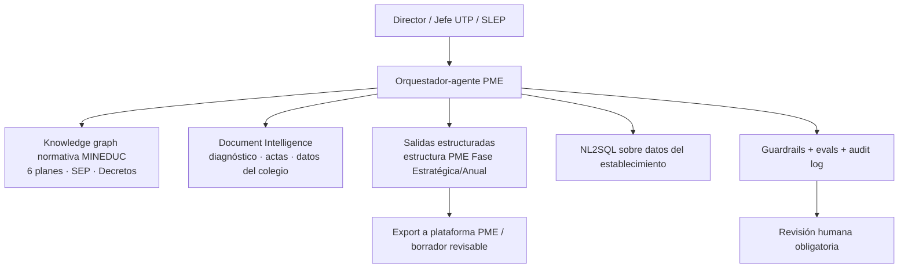

# Run del master prompt — Vertical EDUCACIÓN (carga burocrática docente)

> Ejecución del `master-prompt-chile-govtech-startups.md` sesgada a Educación, con supuestos de Fase 0 asumidos (corregibles). Entregables en español de Chile. Referencias a anclajes verificados: `[E#]` (educación), `[A#]` (transversal). `[VERIFICAR]` = dato a confirmar antes de un pitch real.

---

## FASE 0 — Calibración (supuestos asumidos)

| # | Input | Supuesto asumido |
|---|---|---|
| 1 | Equipo | 2–4 personas: 1 técnico full-stack/IA, 1 con dominio educativo (ex-docente/jefe UTP o coordinador PIE), apoyo de ventas/partnerships part-time. |
| 2 | Horizonte | ~8–10 semanas a un demo funcional para competencia. |
| 3 | Competencia objetivo | Portafolio: **Impacta GovTech / Desafíos Públicos** (encaje GovTech) + **Brain Chile** y **Start-Up Chile** (tecnología/escalabilidad). |
| 4 | Recursos | Presupuesto modesto de APIs/infra; **se requiere conseguir 1–2 colegios piloto** (idealmente uno particular subvencionado con PIE y uno SLEP). |
| 5 | Apetito | Foco 100% Educación ahora; otros verticales quedan para proyectos futuros. |
| 6 | Riesgo regulatorio | Dispuestos a tratar datos de estudiantes **con privacy-by-design** (Ley 21.719 [A13]/[E15]). |
| 7 | Objetivo real | Construir empresa con venta a colegios (vía SEP) y al Estado (sostenedores/SLEP), no solo ganar la competencia. |

> Si alguno de estos supuestos no calza con tu realidad, corrígelo y re-ejecuto las fases afectadas.

---

## FASE 1 — Mapa de oportunidades (6 conceptos)

### C1 — "Aula sin papeleo" / Copiloto de informes Decreto 67 + PACI (NEE)
- **Dolor + evidencia:** papeleo per-alumno intenso: informes individualizados para estudiantes en riesgo de no promoción (Decreto 67, [E10]) y **PACI por estudiante** con NEE (Decreto 83, [E11]); todo compitiendo por las ~horas no lectivas escasas [E1]–[E3]; 33% de docentes estresados por carga administrativa [E4].
- **Usuario / comprador:** docente, profesor jefe y **coordinador/a PIE** (usuarios) ; sostenedor/dirección con fondos SEP (comprador) [E14].
- **Stack 2026:** Document Intelligence (extrae de notas/asistencia/observaciones) + Salidas estructuradas (formato compatible SIGE/reglamento) + Agentes (borrador → revisión humana) + Evals/guardrails [A13d].
- **Why-now:** Ley 21.719 endurece datos de menores [E15] (los que cumplen ganan confianza); MINEDUC empuja desburocratizar ("Todos al Aula") y publica guía de IA [E16].
- **Foso:** dominio NEE + integración con instrumentos oficiales [E12] + corpus de reglamentos/PACI; el incumbente no destaca esta generación regulada [E13].
- **Cuña:** generar el **PACI** y el **informe Decreto 67** en minutos a partir de datos ya existentes, con humano-en-el-loop.
- **Riesgo:** que sea visto como "decisión automatizada" sobre el estudiante → mitigar con human-in-the-loop, explicabilidad y consentimiento (Art. 8 bis/[E15]).

### C2 — "PME en un clic" / Copiloto de PME + seis planes normativos
- **Dolor + evidencia:** el **PME** consolida los seis planes obligatorios, el cumplimiento SEP y la rendición anual, y se comparte con la Agencia de Calidad; la Superintendencia lo pide vía plataforma desde el 31-mayo [E6]–[E9].
- **Usuario / comprador:** jefe UTP/dirección (usuario); **sostenedor / Director Ejecutivo de SLEP** (comprador) [E17].
- **Stack 2026:** Agentes + Document Intelligence + Capa semántica/NL2SQL sobre datos del establecimiento + Knowledge graph normativo + Salidas estructuradas hacia la estructura del PME.
- **Why-now:** consolidación de compradores en ~70 **SLEP** [E17] = venta centralizada de mayor ACV; ciclo PME de 4 años recién en marcha [E8].
- **Foso:** modelar la estructura regulada del PME (Fase Estratégica/Anual) + integración con la plataforma; expertise de fiscalización.
- **Cuña:** generar el **borrador del PME anual + casillas de los seis planes** desde el diagnóstico y datos del colegio.
- **Riesgo:** elegibilidad SEP (el PME es el instrumento SEP, pero enmarca como gestión curricular/calidad, no contabilidad) [E14].

### C3 — Copiloto de reglamento de evaluación + cumplimiento normativo
- **Dolor:** cada colegio debe elaborar/ajustar el **Reglamento de Evaluación (≥16 ítems a–p), subirlo a SIGE** y resistir fiscalización [E10].
- **Comprador:** dirección/sostenedor. **Stack:** Knowledge graph de normativa MINEDUC + generación + checklist de cumplimiento. **Foso:** grafo regulatorio actualizado. **Cuña:** "audita y completa tu reglamento antes de la fiscalización". **Riesgo:** alcance acotado (se hace 1 vez/año) → mejor como módulo de C1/C2.

### C4 — Copiloto de planificación + evaluación diversificada (DUA/Decreto 67)
- **Dolor:** planificación y evaluación consumen el 50% reservado de horas no lectivas [E1]. **Comprador:** colegio (SEP, claramente pedagógico [E14]). **Stack:** generación alineada a currículum + evaluación diversificada. **Foso bajo:** territorio de Lirmi/incumbentes [E13] salvo diferenciación IA-nativa fuerte. **Riesgo:** comoditización.

### C5 — Asistente conversacional de normativa para docentes/directivos
- **Dolor:** la normativa MINEDUC es densa y dispersa. **Stack:** RAG + knowledge graph normativo (chatbot **"riesgo limitado"** bajo la ley de IA [A12]). **Foso bajo** por sí solo. **Mejor como wedge/feature** de C1–C3. **Riesgo:** wrapper si no se ancla en datos propios.

### C6 — Automatizador de rendición de cuentas SEP
- **Dolor:** rendición anual obligatoria a la Superintendencia [E9]. **Problema de modelo:** software de **rendición/contabilidad está PROHIBIDO de financiar con SEP** [E14] → peor economía de compra (subvención general). **Riesgo:** financiamiento. Mantener como módulo secundario, no como producto ancla.

| Concepto | Dolor | Foso | Elegible SEP | Veredicto rápido |
|---|---|---|---|---|
| C1 Informes/PACI (NEE) | Alto, per-alumno | Alto | Sí (pedagógico) | **Ancla** |
| C2 PME + planes | Alto, por colegio | Alto | Sí (enmarcar) | **Ancla** |
| C3 Reglamento/cumplimiento | Medio (anual) | Medio-alto | Sí | Módulo |
| C4 Planificación/eval | Alto pero comoditizado | Bajo | Sí | Descartar/diferir |
| C5 Chatbot normativa | Medio | Bajo solo | Indirecto | Wedge/feature |
| C6 Rendición SEP | Alto | Medio | **No (prohibido)** | Diferir |

---

## FASE 2 — Puntuación y selección

Rúbrica alineada a criterios de jurado [A17] (1–5; pesos entre paréntesis).

| Eje (peso) | C1 NEE | C2 PME | C3 Regl. | C5 Chatbot |
|---|---|---|---|---|
| Innovación tecnológica (15%) | 4 | 5 | 3 | 3 |
| Escalabilidad (15%) | 4 | 5 | 4 | 4 |
| Defensibilidad/foso (20%) | 5 | 5 | 4 | 2 |
| Oportunidad de mercado (15%) | 4 | 5 | 3 | 3 |
| Impacto (15%) | 5 | 4 | 3 | 3 |
| Factibilidad MVP 8–10 sem (10%) | 4 | 3 | 5 | 5 |
| Camino de venta (SEP/SLEP) (5%) | 4 | 5 | 4 | 3 |
| Riesgo regulatorio invertido (5%) | 3 | 4 | 5 | 5 |
| **Total ponderado (aprox.)** | **4.3** | **4.6** | **3.6** | **3.1** |

**Selección recomendada (2 + 1 wedge):**
1. **C2 — "PME en un clic"** (líder): mayor ACV, comprador que se centraliza en SLEP [E17], mercado direccionable concreto (~9.173 colegios en plataforma PME [E8]).
2. **C1 — "Aula sin papeleo" (NEE)**: foso e impacto altos, dolor per-alumno, claramente pedagógico/SEP [E14].
3. **C5/C3 como wedge incluido**: chatbot de normativa + auditoría de reglamento como gancho de adopción de bajo riesgo.

**Lógica de portafolio:** C2 es el producto de plataforma de alto valor que se vende al sostenedor/SLEP; C1 es el producto de foso profundo que entra por el dolor agudo del docente/PIE y genera datos propietarios; el wedge (C5/C3) baja la fricción de entrada y alimenta el grafo normativo común. Los tres comparten un **núcleo común**: un **knowledge graph de normativa MINEDUC + integración con instrumentos oficiales (SIGE/PME)**, que es el foso real de la empresa.

---

## FASE 3 — Especificación de build

### 3.A Producto líder — C2 "PME en un clic"

1. **Problema cuantificado.** Generar y mantener el PME (que consolida 6 planes + SEP + rendición + Agencia de Calidad) es trabajo manual recurrente en ~9.173 colegios [E6]–[E9]; la Superintendencia lo exige vía plataforma desde el 31-mayo [E7].
2. **Solución (3 frases).** Conecta los datos del colegio → genera el borrador del PME anual (Fase Estratégica/Anual) con las casillas de los seis planes y acciones pre-pobladas → el equipo directivo revisa, ajusta y exporta para la plataforma MINEDUC. Todo con trazabilidad y citas a la normativa.
3. **Arquitectura.**

   Determinista: extracción/estructura. Probabilístico: redacción de objetivos/acciones (siempre con revisión humana).
4. **Datos y foso.** Corpus de normativa + plantillas PME + (con permiso) PMEs históricos del colegio → el grafo normativo y los patrones por tipo de establecimiento se vuelven ventaja acumulativa.
5. **MVP (8–10 sem).** ENTRA: grafo normativo de los 6 planes + generación del borrador de la Fase Anual + mapeo de casillas + export revisable + 1 colegio piloto. NO ENTRA: integración API directa con la plataforma MINEDUC `[VERIFICAR: factibilidad de integración]`, multi-establecimiento SLEP, analítica de cumplimiento avanzada.
6. **Evals, guardrails y cumplimiento.** Evals de fidelidad normativa (¿cada acción cita la norma correcta?); guardrails anti-alucinación; cumplimiento Ley 21.719 [E15] (datos del colegio, no necesariamente de menores en v1); enmarcado como **gestión curricular/calidad** para elegibilidad SEP [E14]; clase de riesgo de IA: apoyo a gestión → bajo [A12].
7. **Costos.** Por token/documento; caching del corpus normativo [A]; modelo barato para extracción + modelo fuerte para redacción (routing).
8. **Roadmap.** MVP colegio → piloto con un **SLEP** (comprador centralizado [E17]) → multi-establecimiento + módulo de rendición.
9. **Equipo / build-vs-buy.** Comprar OCR/Document AI; construir el grafo normativo y la lógica PME (es el foso).

### 3.B Producto de foso — C1 "Aula sin papeleo" (NEE) — resumen
- **Arquitectura:** Document Intelligence sobre datos del alumno → genera borrador de **PACI (Decreto 83)** e **informe Decreto 67** en formato del reglamento, con human-in-the-loop y explicabilidad.
- **MVP:** generador de PACI + informe a partir de datos existentes; 1 colegio con PIE.
- **Cumplimiento (crítico):** datos sensibles de menores [E15] → consentimiento parental cuando el tratamiento excede el mandato legal; Art. 8 bis [A13d] → nunca decisión automatizada sin revisión humana y explicación.
- **Venta:** claramente apoyo NEE/pedagógico → elegible SEP [E14].

---

## FASE 4 — Paquete de pitch (producto líder C2; con notas de C1)

1. **One-liner.** "Copiloto de cumplimiento para colegios: convierte semanas de papeleo del PME y los planes obligatorios en un borrador revisable en minutos."
2. **Problema.** ~9.173 colegios deben construir y mantener el PME que concentra 6 planes + SEP + rendición + Agencia de Calidad [E6]–[E9]; el 33% de los docentes ya sufre sobrecarga administrativa [E4] y el tiempo no lectivo es legalmente escaso [E1]–[E3].
3. **Mercado (bottom-up, Chile).**
   - SAM público en transición: **36 SLEP operando** (≈640.000 estudiantes) → **~70 proyectados** [E17]; cohorte de referencia: 4 SLEP = 212 colegios / 5.754 docentes [E17].
   - Plataforma PME: **~9.173 establecimientos** [E8] como universo direccionable.
   - `[VERIFICAR: ticket anual por colegio/SLEP y conteo total de colegios por segmento]` → completar TAM/SAM/SOM con precios reales.
4. **Demo (2–3 min).** Subir diagnóstico → generar borrador de Fase Anual con casillas de los 6 planes → mostrar trazabilidad a la norma → exportar.
5. **Modelo de negocio.** SaaS por establecimiento (subvención general / o SEP si se enmarca pedagógicamente [E14]); contratos multi-establecimiento con **SLEP** [E17]; sector público vía ChileCompra [A5–A10].
6. **GTM / camino de venta.** Entrar por colegio piloto → caso → vender al **Director Ejecutivo del SLEP** (comprador centralizado) → opcional **Contratos para la Innovación** del Estado (I+D financiada, [A7]) y Compra Ágil/Convenio Marco [A5][A10].
7. **Tracción a conseguir antes/durante la competencia.** 1–2 colegios piloto + carta de interés de un SLEP/sostenedor + métrica de horas ahorradas en el borrador del PME `[VERIFICAR: medir baseline]`.
8. **Competencia y foso.** Napsis/Lirmi hacen registro diario pero **no la generación/consolidación regulada** [E13]; foso = grafo normativo + integración con instrumentos oficiales + expertise de fiscalización [E12].
9. **Ask / uso de fondos.** Encaja con premios reales (Impacta GovTech USD 130k [A14]; Brain Chile ~US$40k [A16]) para financiar pilotos e integración.
10. **Equipo.** Técnico IA + dominio educativo (ex-UTP/PIE) = credibilidad regulatoria.
11. **Estructura de slides (Brain Chile/Start-Up Chile):** Problema → Tamaño/urgencia → Producto/demo → Por qué ahora (SLEP + ley IA + Ley 21.719) → Foso → Modelo y GTM (SEP/SLEP) → Tracción → Equipo → Ask.
12. **Riesgos y respuestas a jurado.**
    - *"¿Es un wrapper de ChatGPT?"* → No: el valor está en el grafo normativo + integración con instrumentos oficiales + workflow regulado [E12].
    - *"¿Y la privacidad de datos de menores?"* → v1 trata datos del colegio; en C1 (NEE) aplicamos consentimiento parental y human-in-the-loop bajo Ley 21.719 [E15]/[A13d].
    - *"¿Cómo lo pagan los colegios?"* → SEP si se enmarca como gestión curricular/calidad [E14], o subvención general; contrato con SLEP para escala [E17].

> **Vacíos a cerrar antes del pitch final** (marcados `[VERIFICAR]`): cifra de **horas/semana** de carga administrativa (no se encontró estudio chileno verificable — medir baseline propio en el piloto); **ticket/WTP y conteo por segmento**; factibilidad de **integración con la plataforma MINEDUC**; regulación operativa de la **APDP** antes del 1-dic-2026.
