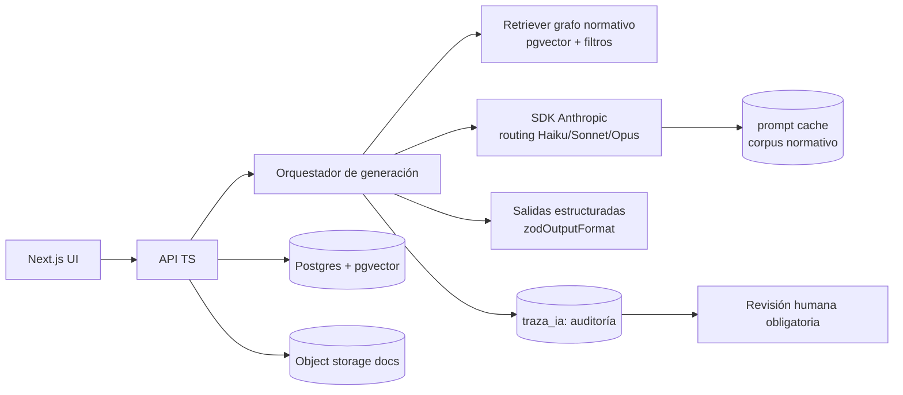

# Plan de implementación ejecutable — Faro (MVP 8–10 semanas)

> **⚠️ Nota v2 (2026-06-07):** este backlog es del producto **v1 (normativo)** y está **aparcado**. El plan de build vigente vive en `specs/` (ver `specs/README.md` §0). Se conserva como referencia.
>
> **Arquitectura autoritativa:** ver `arquitectura-faro.md` (blueprint del arquitecto, Opus 4.8). Este doc es el backlog operativo; ante diferencias manda el blueprint, que ajusta el plan con: monorepo de dominio (ports & adapters), **generación asíncrona** (worker/cola, no en el request HTTP), y **corpus versionado** (`corpus_version`). Construcción por fases (§11 del blueprint).

> Plan operativo para construir el MVP de **Faro** (ver `solucion-educacion.md`). Backlog accionable con épicas → historias → tareas, estimaciones, criterios de aceptación, esquema de datos, JSON Schemas, pipeline de IA, evals, cumplimiento y plan semanal. Pensado para un equipo de 2–4 personas. Convenciones: Conventional Commits, TypeScript sin `any`, comentario de 1 línea para decisiones no obvias.
>
> Alcance MVP robusto (~12–14 sem): **Núcleo** (grafo normativo de los 6 planes + Decreto 67/83 subset **+ corpus de currículum/OA**), **M0 Aula** (generador de **pruebas** + **clases/diapositivas**), **M3** (asistente normativo + auditoría de reglamento) y **M1 parcial** (borrador de la Fase Anual del PME). NO entra: integración API directa con la plataforma MINEDUC, M2 NEE completo, multi-establecimiento SLEP, **personalización/evaluación adaptativa por alumno** (perfilamiento → fase posterior con consentimiento [E15]).

---

## 0. Decisiones técnicas (fijadas)

### Stack
- **Frontend:** Next.js (App Router) + React + TypeScript (`strict: true`, sin `any`).
- **Backend:** API en TypeScript (Next.js Route Handlers o servicio Node/Fastify) + capa de IA con el **SDK de Anthropic** (`@anthropic-ai/sdk`).
- **Datos:** PostgreSQL + extensión **pgvector** (embeddings) + **`tsvector`/BM25** (léxico) + almacenamiento de objetos (S3-compatible) para documentos.
- **Recuperación:** RAG **híbrido sobre grafo (GraphRAG legal) con verificación de citas** — Voyage `voyage-law-2` para embeddings `[VERIFICAR]` + reranker. Diseño completo en **`adr-001-recuperacion-rag.md`**.
- **ORM/migraciones:** Drizzle o Prisma (elegir uno; migraciones versionadas).
- **Auth/RBAC:** sesión por establecimiento + roles (docente, UTP, dirección, admin).
- **Observabilidad:** logging estructurado + tabla `traza_ia` (auditoría) + dataset de evals versionado en repo.

### Modelos de IA (rutas por costo/calidad)
> Verificado vía skill `claude-api` (cache 2026-05-26). IDs exactos, sin sufijos de fecha.

| Uso | Modelo | ID | Precio in/out (USD/1M) |
|---|---|---|---|
| Extracción/clasificación de alto volumen (OCR→entidades, etiquetado) | **Haiku 4.5** | `claude-haiku-4-5` | $1 / $5 |
| Redacción de borradores (acciones PME, informes, auditoría reglamento) | **Sonnet 4.6** | `claude-sonnet-4-6` | $3 / $15 |
| Casos complejos/ambiguos, razonamiento normativo profundo | **Opus 4.8** | `claude-opus-4-8` | $5 / $25 |

- **Thinking:** en Opus/Sonnet usar `thinking: {type: "adaptive"}` (no `budget_tokens` — da 400 en Opus 4.8). `output_config: {effort: "..."}` para ajustar profundidad.
- **Salidas estructuradas:** `client.messages.parse()` con `zodOutputFormat(schema)` (helper `@anthropic-ai/sdk/helpers/zod`). Soportado en Opus 4.8 / Sonnet 4.6 / Haiku 4.5. Limitaciones: sin recursión, sin `minLength`/`maximum`; el SDK valida client-side los constraints no soportados.
- **Prompt caching del corpus normativo:** `cache_control: {type: "ephemeral"}` sobre el bloque `system` que contiene la normativa relevante (prefijo estable primero). Lectura ~0.1×, escritura 1.25× (TTL 5 min). **Mínimo cacheable: 4096 tokens** en Opus/Haiku, 2048 en Sonnet 4.6 — por debajo no cachea (silencioso). Verificar con `usage.cache_read_input_tokens`.
- **Build-vs-buy:** comprar OCR/Document AI; construir el grafo normativo y la lógica regulada (el foso).

### Estándares de ingeniería
- Conventional Commits (`feat:`, `fix:`, `refactor:`, `docs:`, `test:`, `chore:`).
- Sin `console.log` en producción (usar logger). Sin `any` salvo justificación inline.
- Toda decisión no obvia: 1 línea de comentario explicando el *por qué*.
- PR con review antes de merge (rama por feature).

---

## 1. Arquitectura de ejecución (resumen)



---

## 2. Modelo de datos (DDL de referencia)

```sql
-- Normativa (el foso). 'cuerpo' es el texto citable; 'embedding' para retrieval.
CREATE TABLE norma (
  id            uuid PRIMARY KEY DEFAULT gen_random_uuid(),
  tipo          text NOT NULL,              -- ley | decreto | plan | orientacion
  referencia    text NOT NULL,              -- p.ej. 'Decreto 67/2018 art. 18 lit. f'
  titulo        text NOT NULL,
  cuerpo        text NOT NULL,
  vigencia_desde date,
  vigencia_hasta date,                      -- NULL = vigente
  embedding     vector(1536),               -- dim según modelo de embeddings elegido
  metadata      jsonb DEFAULT '{}'::jsonb
);
CREATE INDEX idx_norma_embedding ON norma USING ivfflat (embedding vector_cosine_ops);

-- Relaciones del grafo (norma -> plan obligatorio, deroga, modifica, requiere)
CREATE TABLE norma_relacion (
  origen_id uuid REFERENCES norma(id),
  destino_id uuid REFERENCES norma(id),
  tipo      text NOT NULL,                  -- consolida_en_pme | deroga | modifica | requiere
  PRIMARY KEY (origen_id, destino_id, tipo)
);

CREATE TABLE establecimiento (
  id           uuid PRIMARY KEY DEFAULT gen_random_uuid(),
  rbd          text UNIQUE NOT NULL,
  nombre       text NOT NULL,
  dependencia  text NOT NULL,              -- municipal | slep | part_subv | part_pagado
  convenio_sep boolean NOT NULL DEFAULT false
);

-- Documentos generados (PME, reglamento auditado, etc.) con citas y revisión humana.
CREATE TABLE documento_generado (
  id                uuid PRIMARY KEY DEFAULT gen_random_uuid(),
  establecimiento_id uuid REFERENCES establecimiento(id),
  tipo              text NOT NULL,          -- pme_fase_anual | reglamento_auditoria | informe67
  contenido         jsonb NOT NULL,         -- estructura validada por JSON Schema
  citas             jsonb NOT NULL DEFAULT '[]'::jsonb,  -- [{norma_id, referencia}]
  estado_revision   text NOT NULL DEFAULT 'borrador',    -- borrador | revisado | aprobado
  autor_humano      uuid,                   -- usuario que revisó/aprobó
  created_at        timestamptz NOT NULL DEFAULT now()
);

-- Auditoría de IA (cumple Art. 8 bis: trazabilidad de decisiones automatizadas).
CREATE TABLE traza_ia (
  id            uuid PRIMARY KEY DEFAULT gen_random_uuid(),
  documento_id  uuid REFERENCES documento_generado(id),
  modelo        text NOT NULL,
  prompt_hash   text NOT NULL,
  citas         jsonb NOT NULL,
  evals         jsonb,
  revisor       uuid,
  created_at    timestamptz NOT NULL DEFAULT now()
);
```
> Nota: `estudiante` y `PACI` quedan fuera del MVP (M2). Cuando entren, datos sensibles → cifrado + base de licitud explícita [E15].

---

## 3. JSON Schemas (salidas estructuradas)

### 3.1 Acción del PME (Fase Anual)
```ts
// schemas/pmeAccion.ts
import { z } from "zod";

export const PmeAccion = z.object({
  dimension: z.enum([
    "gestion_pedagogica", "liderazgo", "convivencia_escolar", "gestion_recursos",
  ]),
  nombre: z.string(),
  descripcion: z.string(),
  planes_normativos_cubiertos: z.array(z.enum([
    "convivencia", "formacion_ciudadana", "pise", "formacion_docente", "sexualidad", "inclusion",
  ])),                                   // mapea a las casillas de los 6 planes [E6][E7]
  indicador_seguimiento: z.string(),
  citas_normativa: z.array(z.object({
    referencia: z.string(),              // p.ej. 'Ley 20.911 (Formación Ciudadana)'
    norma_id: z.string(),
  })),
});
export const PmeFaseAnual = z.object({ acciones: z.array(PmeAccion) });
```

### 3.2 Auditoría de reglamento de evaluación (Decreto 67)
```ts
// schemas/reglamentoAuditoria.ts
import { z } from "zod";

export const ReglamentoAuditoria = z.object({
  items: z.array(z.object({
    item: z.enum([                        // 16 ítems a–p del Decreto 67/2018 art. 18 [E10]
      "a","b","c","d","e","f","g","h","i","j","k","l","m","n","o","p",
    ]),
    descripcion_item: z.string(),
    presente: z.boolean(),
    hallazgo: z.string(),                 // qué falta o qué corregir
    sugerencia: z.string(),               // redacción propuesta (revisable)
    cita: z.string(),                     // 'Decreto 67/2018 art. 18 lit. X'
  })),
  cumple_minimo: z.boolean(),             // ≥16 ítems presentes
});
```

> Uso: `client.messages.parse({ model, max_tokens, output_config: { format: zodOutputFormat(ReglamentoAuditoria) }, ... })`. `parsed_output` puede ser `null` si hay refusal/max_tokens → manejar.

### 3.3 Prueba / evaluación (Módulo Aula)
```ts
// schemas/prueba.ts
import { z } from "zod";

export const ItemPrueba = z.object({
  oa: z.string(),                                    // OA al que tributa (currículum)
  habilidad: z.enum(["recordar","comprender","aplicar","analizar","evaluar","crear"]),
  tipo: z.enum(["seleccion_multiple","verdadero_falso","desarrollo","completacion"]),
  enunciado: z.string(),
  alternativas: z.array(z.object({ texto: z.string(), correcta: z.boolean() })).optional(),
  respuesta_correcta: z.string().optional(),         // para desarrollo/completación
  puntaje: z.number(),
});
export const Prueba = z.object({
  asignatura: z.string(),
  curso: z.string(),
  tabla_especificaciones: z.array(z.object({ oa: z.string(), n_items: z.number(), puntaje: z.number() })),
  items: z.array(ItemPrueba),
  pauta_correccion: z.string(),
  alineada_reglamento: z.boolean(),                  // respeta el reglamento Decreto 67 del colegio [E10]
  version_nee_dua: z.boolean(),                       // variante diversificada Decreto 83 [E11]
});
```

### 3.4 Clase / diapositivas (Módulo Aula)
```ts
// schemas/clase.ts
import { z } from "zod";

export const Clase = z.object({
  asignatura: z.string(),
  curso: z.string(),
  oa: z.array(z.string()),                            // OA cubiertos
  momentos: z.object({ inicio: z.string(), desarrollo: z.string(), cierre: z.string() }),
  diapositivas: z.array(z.object({
    titulo: z.string(), contenido: z.string(), notas_docente: z.string(),
  })),
  actividades: z.array(z.string()),
});
```
> Export: `.pptx` real vía code execution (python-pptx) o skill `pptx`; prueba a `.docx`/`.pdf` (python-docx). El sandbox de code execution trae python-pptx/python-docx preinstalados.

---

## 4. Pipeline de generación — RAG híbrido sobre grafo (ver `adr-001-recuperacion-rag.md`)

> Recuperación robusta por capas; cada capa elimina un modo de falla del RAG ingenuo.

1. **Pre-filtro de metadatos:** solo normas **vigentes** (`vigencia_hasta IS NULL OR > hoy`), por dependencia/tipo. → mata "artículo derogado".
2. **Recuperación híbrida:** vector (pgvector) **+ BM25/full-text** (`tsvector`) → fusión con RRF. → mata recall por términos/números exactos.
3. **Expansión por grafo (GraphRAG):** desde los nodos semilla, traer versión vigente + dependencias (`modifica`, `requiere`, `consolida_en_pme`). → multi-hop.
4. **Reranking:** cross-encoder o pase barato de Haiku → top-k preciso.
5. **Parent-document:** devolver el artículo/norma completa, no solo el chunk.
6. **Construir prompt:** contexto recuperado **+ (núcleo acotado) subset curado completo**, ambos en `system` con `cache_control: {ephemeral}` (prefijo estable primero; datos del colegio al final).
7. **Rutar modelo + generar:** Haiku (extracción) / Sonnet (redacción) / Opus (ambiguo), adaptive thinking, salida estructurada (Zod) con **citas obligatorias por afirmación**.
8. **Gate de verificación de citas (no negociable):** cada cita debe existir (DB), estar vigente (DB) y respaldar la afirmación (verificador Haiku). Si falla → marca/bloquea, no se aprueba.
9. **Persistir** `documento_generado` (estado `borrador`) + `traza_ia` (incluye qué se recuperó).
10. **Revisión humana obligatoria** antes de `aprobado` (Art. 8 bis [E15]).

```ts
// Pseudocódigo del orquestador (TS)
const semillas = await retriever.hibrida({ query, dependencia, soloVigentes: true }); // vector + BM25 + RRF
const normas   = await grafo.expandir(semillas);          // versión vigente + dependencias
const top      = await reranker.ordenar(query, normas);   // cross-encoder o Haiku
const system = [
  { type: "text", text: PROMPT_BASE },
  { type: "text", text: serializar(top, subsetNucleo), cache_control: { type: "ephemeral" } },
];
const res = await client.messages.parse({
  model: ruta(tarea), max_tokens: 16000, thinking: { type: "adaptive" },
  system, messages: [{ role: "user", content: entradaColegio }],
  output_config: { format: zodOutputFormat(schema) },
});
if (!res.parsed_output) throw new GeneracionError(res.stop_reason);
await verificador.citas(res.parsed_output, top);          // existe + vigente + respalda; si no → bloquea
```

```ts
// Pseudocódigo del orquestador (TS)
const normas = await retriever.buscar({ query, dependencia, soloVigentes: true });
const system = [
  { type: "text", text: PROMPT_BASE },
  { type: "text", text: serializarNormas(normas), cache_control: { type: "ephemeral" } },
];
const res = await client.messages.parse({
  model: ruta(tarea),                 // 'claude-sonnet-4-6' por defecto
  max_tokens: 16000,
  thinking: { type: "adaptive" },
  system,
  messages: [{ role: "user", content: entradaColegio }],
  output_config: { format: zodOutputFormat(schema) },
});
if (!res.parsed_output) throw new GeneracionError(res.stop_reason);
await evals.verificarGrounding(res.parsed_output, normas); // citas vigentes
```

---

## 5. Backlog (épicas → historias → tareas)

> Estimaciones en puntos relativos (S=½d, M=1–2d, L=3–5d). Cada historia lista su criterio de aceptación (CA).

### ÉPICA A — Fundaciones (infra + esqueleto)
- **A1** Repo, CI, lint/format, `tsconfig strict`, Conventional Commits hook. _(M)_ — CA: `pnpm build` y `pnpm lint` pasan en CI.
- **A2** Postgres + pgvector + migraciones del §2. _(M)_ — CA: migración up/down aplica sin error.
- **A3** Auth + RBAC por establecimiento (docente/UTP/dirección/admin). _(M)_ — CA: rutas protegidas por rol.
- **A4** Wrapper del SDK Anthropic con routing de modelos + logging de `usage`/cache. _(M)_ — CA: una llamada de prueba registra `cache_read_input_tokens`.

### ÉPICA B — Núcleo: grafo normativo + RAG híbrido (EL FOSO) — ver `adr-001-recuperacion-rag.md`
- **B1** Ingesta con **chunking estructural** (ley→art→inciso→letra) de 6 planes [E6] + Decreto 67 (16 ítems) + Decreto 83 (subset); cada chunk = unidad citable con `referencia` + vigencia. _(L)_ — CA: chunks con referencia canónica y vigencia.
- **B2** **Doble índice**: embeddings (Voyage `voyage-law-2` `[VERIFICAR]`) en pgvector **+ BM25/`tsvector`**. _(M)_ — CA: ambos índices consultables.
- **B3** **Recuperación híbrida** (vector + BM25 + RRF) con pre-filtro de vigencia. _(M)_ — CA: query devuelve solo vigentes y captura términos exactos ("art. 18 letra f").
- **B4** Relaciones del grafo + **expansión GraphRAG** (`consolida_en_pme`, `deroga`, `modifica`, `requiere`). _(M)_ — CA: trae la versión vigente cuando el semilla está modificado; cada plan mapea a su casilla PME.
- **B5** **Reranking** (Haiku o cross-encoder) + **parent-document**. _(M)_ — CA: top-k reordenado; se devuelve el artículo completo.
- **B6** Prompt caching del corpus + verificación de hits. _(S)_ — CA: `cache_read_input_tokens > 0` en 2ª llamada idéntica.

### ÉPICA C — M3: Asistente normativo + auditoría de reglamento (CUÑA)
- **C1** Chat de consulta normativa con **citas obligatorias** (RAG sobre grafo). _(L)_ — CA: toda respuesta incluye ≥1 cita verificable; sin cita → no responde.
- **C2** Auditoría de reglamento de evaluación (Decreto 67, schema §3.2): subir/pegar reglamento → checklist 16 ítems + sugerencias. _(L)_ — CA: detecta ítems faltantes y propone redacción con cita.
- **C3** Guardrails anti prompt-injection + límite "riesgo limitado" [A12]. _(M)_ — CA: inputs maliciosos no alteran citas/comportamiento.

### ÉPICA D — M1 parcial: PME Fase Anual
- **D1** Formulario de diagnóstico/datos del colegio → entrada estructurada. _(M)_ — CA: captura mínima para generar acciones.
- **D2** Generación del borrador de la Fase Anual (schema §3.1) con casillas de los 6 planes. _(L)_ — CA: genera acciones con `planes_normativos_cubiertos` y citas.
- **D3** Editor revisable + export (PDF/estructura compatible). _(M)_ — CA: usuario edita, marca `aprobado`, exporta.

### ÉPICA E — Evals, guardrails y cumplimiento
- **E1** Golden set de evals de fidelidad normativa (≥30 casos). _(L)_ — CA: pipeline de evals corre en CI y reporta tasa de citas correctas.
- **E2** Verificación de grounding (cada afirmación → norma vigente). _(M)_ — CA: bloquea documentos con citas inexistentes/derogadas.
- **E3** Human-in-the-loop: estado `borrador→revisado→aprobado` + `traza_ia`. _(M)_ — CA: ningún documento se "aprueba" sin revisor humano.
- **E4** DPA (contrato de encargo) + mapeo de base de licitud + aviso de transparencia (Art. 14 ter [A13c]). _(M)_ — CA: documento legal listo + página de transparencia.

### ÉPICA F — Piloto, demo y métricas
- **F1** Onboarding de 1–2 colegios piloto (idealmente 1 part. subv. con PIE + 1 SLEP [E17]). _(M)_ — CA: colegio operativo con datos reales.
- **F2** Medición de **horas ahorradas** por documento vs baseline `[VERIFICAR: medir baseline]`. _(M)_ — CA: métrica capturada por documento.
- **F3** Guion + grabación de demo de 2–3 min para competencia. _(S)_ — CA: demo reproducible.

### ÉPICA G — Módulo Aula: pruebas y clases (USO DIARIO)
> Grounding en el **currículum nacional (OA)** + el reglamento de evaluación del colegio (Decreto 67). Misma recuperación robusta del **ADR-001**, sobre el corpus curricular. "Automatizado" = borrador en minutos + revisión del docente (human-in-the-loop, no autonomía ciega).
- **G1** Ingesta del corpus curricular (Bases Curriculares / OA / indicadores) con chunking estructural por OA. _(L)_ — CA: OA consultables por asignatura/curso/nivel.
- **G2** Generador de **evaluaciones** (schema §3.3): tabla de especificaciones, ítems por habilidad, alternativas/desarrollo, puntaje, clave y pauta; alineado a OA + reglamento Decreto 67. _(L)_ — CA: prueba con cobertura de OA y pauta correcta.
- **G3** **Verificación pedagógica** (gate): cada ítem tributa a un OA del curso; selección múltiple con exactamente una correcta; distractores plausibles; chequeo de sesgo. _(M)_ — CA: bloquea/marca ítems inválidos antes de la revisión.
- **G4** Versión **NEE/DUA** (Decreto 83): variante diversificada de la prueba manteniendo los OA. _(M)_ — CA: genera versión adaptada.
- **G5** Generador de **clases/diapositivas** (schema §3.4): inicio/desarrollo/cierre + actividades; **export a `.pptx` real** (code execution python-pptx o skill pptx). _(L)_ — CA: descarga `.pptx` editable alineado al OA.
- **G6** Editor revisable + export (prueba a `.docx`/`.pdf`, clase a `.pptx`). _(M)_ — CA: docente edita, aprueba y descarga.

> Riesgo regulatorio: a nivel **curso/contenido**, no individualizado → bajo riesgo Ley 21.719. Personalización adaptativa por alumno = fase posterior con consentimiento parental [E15].

---

## 6. Plan semanal (8–10 semanas)

| Semana | Foco | Entregables |
|---|---|---|
| 1 | A1–A4 | Infra, CI, DB+pgvector, wrapper SDK con routing |
| 2 | B1–B2 | Corpus de 6 planes + Decreto 67/83 ingestado; retriever |
| 3 | B3–B4 + C1 | Grafo (relaciones) + caching; chat normativo con citas |
| 4 | C2–C3 | Auditoría de reglamento (16 ítems) + guardrails |
| 5 | D1–D2 | Diagnóstico + generación borrador PME Fase Anual |
| 6 | D3 + E1 | Editor/export + golden set de evals |
| 7 | E2–E3 | Grounding + human-in-the-loop + traza_ia |
| 8 | E4 + F1 | DPA/transparencia + onboarding piloto |
| 9 | F2 + hardening | Métricas de horas ahorradas; bugfix; seguridad |
| 10 | F3 + pulido | Demo de competencia + dossier de pitch |

> Si el equipo es de 2 personas, extender a 10–12 semanas o recortar D (PME) a "solo auditoría de reglamento + chat" para el demo.
> **Módulo Aula (Épica G)** agrega ~2–3 semanas (corpus curricular + generadores + verificación pedagógica) → MVP robusto completo ≈ **12–14 semanas**. Para el demo de competencia conviene liderar con **Aula** (uso diario) + **auditoría de reglamento**, que ya muestran valor end-to-end.

---

## 7. Plan de evals (calidad medible)

- **Recuperación (RAG):** `recall@k` (¿se recuperó el artículo correcto?), `precision@k`, MRR sobre golden set etiquetado (meta `recall@k` ≥0.9). Es la métrica que valida que el RAG es robusto.
- **Fidelidad normativa:** % de afirmaciones con cita correcta y vigente (meta ≥95% en golden set).
- **Cobertura de ítems Decreto 67:** % de ítems faltantes detectados correctamente (vs reglamentos etiquetados a mano).
- **Grounding:** 0 documentos `aprobado` con cita inexistente/derogada (gate duro).
- **Costo/latencia:** registrar `usage` + `cache_read_input_tokens`; verificar que el routing baja costo unitario.
- Ejecutar en CI sobre el golden set; **fallar el build** si `recall@k` o la fidelidad caen bajo umbral.

---

## 8. Cumplimiento como tareas de ingeniería

- [ ] DPA (contrato de encargo de tratamiento) firmable por colegio — Faro = **encargado**, colegio = responsable [E15].
- [ ] Inventario de datos + mapeo base de licitud (mandato legal vs consentimiento) [E15].
- [ ] Página de transparencia (Art. 14 ter): categorías, base de licitud, plazo, derechos ARCO+, reclamo ante APDP [A13b][A13c].
- [ ] Human-in-the-loop + explicabilidad + `traza_ia` (Art. 8 bis [A13d]).
- [ ] Cifrado en reposo/tránsito, RBAC, retención/expiración, logs de acceso.
- [ ] Posicionamiento del producto como **gestión curricular/pedagógica** (elegibilidad SEP), nunca contabilidad/rendición [E14].

---

## 9. Definición de "Done" (por historia)
- Código + tests; lint y typecheck pasan; sin `any` injustificado.
- Si toca IA: schema validado + grounding verificado + traza registrada.
- CA cumplido y demostrable; PR revisado y mergeado con commit convencional.

---

## 10. Riesgos de ejecución y mitigaciones
| Riesgo | Mitigación |
|---|---|
| Corpus normativo incompleto/erróneo | Empezar acotado (6 planes + Decreto 67/83), curado por el experto de dominio; evals de fidelidad |
| Cache no impacta (hits=0) | Auditar invalidadores silenciosos (timestamps/JSON no ordenado en el prefijo); verificar `cache_read_input_tokens` |
| Costo de tokens alto | Routing a Haiku para extracción; caching del corpus; `effort` moderado |
| Sin colegio piloto | Conseguir carta de interés temprano (semana 1–2); usar datos sintéticos para el demo si se atrasa |
| Falta cifra de horas ahorradas `[VERIFICAR]` | Medir baseline propio en el piloto (F2) para el pitch |

---

## 11. Primeros 5 pasos (arrancar ya)
1. `feat: scaffold` — repo Next.js + TS strict + CI (A1).
2. `feat: db` — Postgres + pgvector + migración del §2 (A2).
3. `feat: anthropic-client` — wrapper SDK con routing + logging de cache (A4).
4. `feat: corpus` — ingesta de los 6 planes + Decreto 67 (16 ítems) (B1).
5. `feat: reglamento-audit` — primer flujo end-to-end: auditoría de reglamento con citas (C2) → demo mínima vendible.
