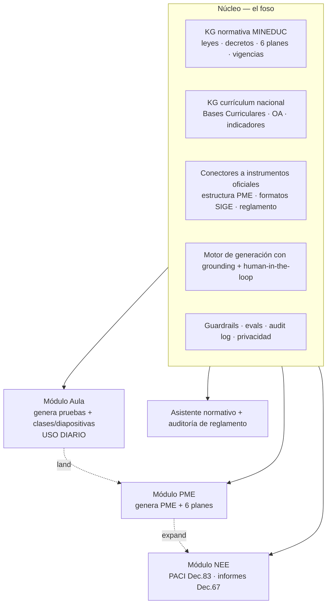
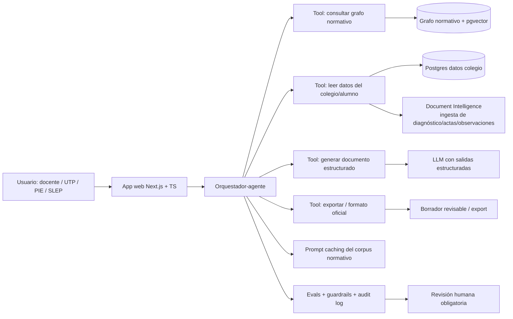

# Solución sólida — Educación: copiloto de cumplimiento y documentación pedagógica para colegios chilenos

> **Interpretación del encargo:** una **única solución sólida** que integra los 3 pilares recomendados (Módulo PME, Módulo NEE/Decreto 67·83, y Asistente normativo + auditoría de reglamento como cuña) sobre **un núcleo común** que es el foso de la empresa. Documento de build + negocio + pitch, a profundidad. Español de Chile. Anclajes verificados `[E#]`/`[A#]`; `[VERIFICAR]` = confirmar antes del pitch real.
>
> **⚠️ Nota v2 (2026-06-07):** este documento es la **visión v1 (copiloto normativo)**. El build actual es **Faro v2**, más acotado: un **generador de planificaciones docentes** (curso + asignatura + OA → `.docx`/`.pdf`) + PPT infantil + prueba formativa, **sin normativa ni RAG**. Esta visión queda como horizonte de largo plazo. Alcance v2 en `specs/README.md` §0.
>
> **Nombre de trabajo:** **"Faro"** (alternativas: *Norma*, *Brújula*, *Bitácora Escolar*). Tagline: *"El copiloto que convierte la normativa en documentos listos para revisar."*

---

## 1. Tesis y posicionamiento

**Problema.** En Chile, los colegios producen y mantienen un aparato documental regulado, recurrente y disperso: el **PME** que consolida 6 planes obligatorios + cumplimiento SEP + rendición + Agencia de Calidad [E6]–[E9]; los **informes per-alumno del Decreto 67** y los **PACI del Decreto 83** [E10][E11]; el **reglamento de evaluación de ≥16 ítems subido a SIGE** [E10]. Todo compite por el tiempo no lectivo legalmente escaso (ratio 65/35; ~100 min/semana para instrumentos de evaluación) [E1]–[E3], y el 33% de los docentes declara la sobrecarga administrativa como estresor top-3 [E4].

**Insight de posicionamiento (decisivo).** Los fondos SEP **pueden** comprar software, pero **solo si se enmarca como gestión curricular/pedagógica** y está escrito en el PME; el software de administración/contabilidad/rendición está **prohibido** de financiar con SEP [E14]. Por eso Faro **no se vende como "software administrativo"**, sino como **apoyo pedagógico y de calidad** (planificación de la mejora, apoyo a estudiantes, evaluación) que *produce* el papeleo regulado como subproducto.

**Por qué ahora (why-now).**
- El comprador público se **centraliza** de cientos de DAEM a ~70 **SLEP**; el Director Ejecutivo compra [E17] → ventas de mayor ACV.
- La **Ley 21.719** (vigente 1-dic-2026) endurece el trato de datos de menores [E15] → quien llega con privacy-by-design gana confianza; los incumbentes genéricos quedan expuestos.
- MINEDUC empuja la **desburocratización** ("Todos al Aula") y ya publicó una **guía de IA** en educación [E16] → clima institucional favorable.
- La futura ley de IA clasifica los chatbots de servicio público como **"riesgo limitado"** [A12] → baja la barrera para el asistente normativo.

**Foso (no es un wrapper).** El valor no está en el LLM, sino en: (1) **dos knowledge graphs curados** — normativa MINEDUC (leyes, decretos, 6 planes, vigencias) y **currículum nacional (Bases Curriculares / OA / indicadores)**, base del grounding de pruebas y clases; (2) **integración con los instrumentos oficiales** (estructura del PME, formatos SIGE, reglamento) [E12]; (3) **expertise de workflow regulado y fiscalización**; (4) datos propietarios que se acumulan por colegio. Napsis/Lirmi cubren el registro diario pero **no la generación/consolidación regulada** [E13].

---

## 2. Arquitectura de producto — un núcleo, cuatro módulos

**Movimiento comercial: land → expand.** El **Módulo Aula (M0)** —generar pruebas y clases/diapositivas en minutos— es el **gancho de uso diario** que mete al producto en la rutina del docente (y es claramente elegible a SEP [E14]); el **Asistente normativo (M3)** complementa con consultas y auditoría de reglamento (chatbot "riesgo limitado" [A12]); luego se monetiza el **Módulo PME (M1)** (alto valor, comprador SLEP/sostenedor [E17]); y se profundiza con el **Módulo NEE (M2)** (foso e impacto altos, dolor del coordinador PIE). Aula y NEE comparten algo clave: ambas se apoyan en el **reglamento de evaluación del colegio (Decreto 67)** y en el **currículum (OA)**, conectando la producción pedagógica con la capa de cumplimiento — algo que un generador genérico no hace.

| Módulo | Hace | Usuario | Comprador | Elegibilidad SEP |
|---|---|---|---|---|
| **M0 Aula** (pruebas + clases/diapositivas) | Genera evaluaciones alineadas a OA + reglamento Decreto 67 (con versión NEE/DUA) y clases inicio/desarrollo/cierre exportables a `.pptx` | Docente | Colegio (SEP, pedagógico) [E14] | Sí (gestión curricular) |
| **M3 Asistente normativo + auditoría reglamento** | Responde normativa con citas; audita y completa el reglamento de evaluación [E10] | Docente / directivo | Colegio (freemium → pago) | Indirecto (apoyo a gestión curricular) |
| **M1 PME + 6 planes** | Genera borrador del PME (Fase Estratégica/Anual) y consolida los 6 planes [E6]–[E8] | Jefe UTP / dirección | **Sostenedor / SLEP** [E17] | Sí (enmarcado como calidad/mejora) [E14] |
| **M2 NEE Decreto 67·83** | Borrador de PACI e informes per-alumno desde datos existentes [E10][E11] | Docente / coordinador PIE | Colegio (fondos SEP/PIE) | Sí (apoyo NEE, pedagógico) [E14] |

---

## 3. Arquitectura técnica (mapeada al stack 2026)

**Mapeo explícito a la caja de herramientas 2026:**
- **Agentes con herramientas:** orquestador que decide qué tool llamar (grafo, datos, generación, export). El sistema *actúa* (produce y exporta documentos), con permisos y revisión humana.
- **Document Intelligence:** ingesta de diagnósticos, actas, observaciones de la hoja de vida, evaluaciones previas → extracción determinista a entidades.
- **Salidas estructuradas:** PME, PACI, informe Decreto 67, **prueba y clase** se generan contra un **JSON Schema** → integrables, auditables.
- **Generación de artefactos:** las pruebas y clases se exportan a formatos reales (`.docx`/`.pdf`/`.pptx`) vía code execution (python-docx/python-pptx) o skills de documentos.
- **Knowledge graph (dos corpus) + capa semántica/NL2SQL:** normativa **y currículum nacional (OA)** como nodos/relaciones con vigencias; consultas NL sobre los datos del establecimiento. Recuperación robusta (RAG híbrido sobre grafo + verificación de citas): ver `adr-001-recuperacion-rag.md`.
- **Prompt/context caching:** el corpus normativo (grande y repetido) se cachea → menor costo/latencia [A].
- **Destilación/routing:** Haiku para extracción/clasificación de alto volumen; Sonnet para redacción; Opus para casos complejos/ambiguos.
- **Evals + guardrails (obligatorio en GovTech):** evals de fidelidad normativa (cada afirmación cita la norma correcta y vigente), grounding/citation enforcement, guardrails de PII, y **human-in-the-loop no opcional** (nunca decisión automatizada sobre un estudiante, Art. 8 bis [A13d]).

**Stack concreto (alineado a tus convenciones: TS, claridad).**
- Frontend: **Next.js + React + TypeScript** (sin `any`).
- Backend: **Node/TS** (API) + servicio de IA con el **SDK de Anthropic** (Claude Opus/Sonnet/Haiku con routing). `[VERIFICAR: confirmar IDs y precios de modelos vía skill claude-api antes de fijar costos]`.
- Datos: **Postgres** (datos del colegio) + **pgvector** (retrieval del grafo normativo) + almacenamiento de objetos para documentos.
- Document AI: servicio de OCR/layout (build-vs-buy: **comprar** OCR, **construir** el grafo y la lógica regulada = el foso).
- Observabilidad: trazas + dataset de evals versionado.

---

## 4. Modelo de datos (entidades núcleo)

- **Norma**: {tipo: ley|decreto|plan|orientación, id, artículos, vigencia_desde/hasta, relaciones}.
- **Establecimiento**: {RBD, dependencia: municipal|SLEP|part.subv|part.pagado, convenio_SEP, PME_id}.
- **PME**: {fase_estratégica, fase_anual, dimensiones, acciones[], casillas_planes[6]}.
- **Estudiante** (sensible): {id, NEE?, PIE?} → minimización y cifrado; base de licitud explícita [E15].
- **ObjetivoAprendizaje (OA)**: {id, asignatura, curso/nivel, descripción, indicadores, embedding} → corpus curricular para Aula (mismo patrón de recuperación, `adr-001-recuperacion-rag.md`).
- **DocumentoGenerado**: {tipo: PME|PACI|informe67|reglamento|**prueba|clase**, borrador, citas/OA[], estado_revisión, autor_humano}.
- **TrazaIA**: {prompt, modelo, citas, evals, revisor, timestamp} → auditabilidad y Art. 8 bis.

---

## 5. Cumplimiento y seguridad (de diseño)

- **Rol legal:** Faro actúa como **encargado de tratamiento** (procesador) por cuenta del colegio/sostenedor, que es el **responsable** [E15]. → Firmar **contrato de encargo (DPA)** con cada cliente; documentar finalidades y subprocesadores.
- **Datos de menores (Ley 21.719 Art. 16 quáter) [E15]:** mapear **base de licitud por dato** (mandato legal vs consentimiento). Para tratamiento que excede el mandato (p. ej. analítica socioemocional/predicción), **consentimiento parental** (<14) y **parental para datos sensibles <16**. Datos de salud/socioemocionales = **sensibles**.
- **Decisiones automatizadas (Art. 8 bis) [A13d]:** Faro **no decide** sobre el estudiante; **siempre** genera *borradores* que un humano revisa, con explicación y citas → cumple "información significativa sobre la lógica" y derecho a intervención humana.
- **Elegibilidad SEP [E14]:** posicionar como gestión curricular/calidad escrita en el PME; **nunca** vender el módulo como "contabilidad/rendición" (prohibido). El módulo de rendición, si se hace, se financia con subvención general.
- **Clase de riesgo IA [A12]:** apoyo a gestión + chatbot normativo = bajo/limitado.
- **Seguridad:** cifrado en reposo/tránsito, minimización de datos, RBAC, retención/expiración, logs de acceso. Anti prompt-injection en el asistente.

> Privacy-by-design no es solo cumplimiento: es **argumento de venta** frente a incumbentes genéricos.

---

## 6. MVP y roadmap

**MVP robusto (~12–14 semanas, priorizando robustez sobre velocidad) — entra:**
- Núcleo: grafo normativo (**6 planes + Decreto 67/83**) **+ corpus de currículum/OA**, con grounding y vigencias.
- **M0 Aula** (cuña de uso diario): generador de **pruebas** (alineadas a OA + reglamento Decreto 67, con versión NEE/DUA) y de **clases/diapositivas** (export `.pptx`), con verificación pedagógica + revisión docente.
- **M3**: asistente normativo con citas + auditoría del reglamento de evaluación.
- **M1** (parcial): borrador de la **Fase Anual del PME** con casillas de los 6 planes + export revisable.
- 1–2 colegios piloto (idealmente 1 part. subvencionado con PIE + 1 SLEP).
- Evals (fidelidad normativa + recall@k + alineación a OA) + human-in-the-loop + DPA.

**NO entra (v1):** integración API directa con la plataforma MINEDUC `[VERIFICAR: factibilidad]`; M2 completo; multi-establecimiento SLEP; **personalización/evaluación adaptativa por alumno** (perfilamiento → fase posterior con consentimiento [E15]).

**Roadmap:**
1. **Land** — M0 Aula (uso diario) en colegios → adopción + datos + casos; M3 como complemento.
2. **Expand** — M1 vendido al **SLEP/sostenedor** (contrato multi-establecimiento [E17]); medir horas ahorradas.
3. **Deepen** — M2 NEE (PACI/informes) con consentimiento parental y flujo PIE.
4. **Escala** — integración oficial + módulos de rendición (subvención general) + expansión a otros instrumentos.

---

## 7. Modelo de negocio y unit economics

- **Pricing:** SaaS por establecimiento/año (M1+M3) + add-on por módulo NEE (M2). Contratos multi-establecimiento con **SLEP** (mayor ACV) [E17]. `[VERIFICAR: ticket/WTP por segmento y conteo de colegios — aún abierto]`.
- **Pago:** colegios subvencionados vía **fondos SEP** si está en el PME y es pedagógico [E14]; particular pagado por presupuesto propio; público vía **ChileCompra** (Compra Ágil/Convenio Marco [A5][A10]) y potencialmente **Contratos para la Innovación** (I+D financiada por el Estado [A7]).
- **Costos variables:** por documento/token; **caching del corpus normativo** y **routing a Haiku** para extracción reducen el costo unitario `[VERIFICAR: tarifas de modelo vía claude-api]`.
- **Foso económico:** el grafo normativo es costo fijo amortizable entre todos los colegios → margen creciente con escala.

---

## 8. Go-to-market

1. **Cuña (M3):** entrar gratis/barato por el dolor diario del docente y el directivo → adopción bottom-up.
2. **Caso piloto:** medir **horas ahorradas** y calidad de cumplimiento en 1–2 colegios `[VERIFICAR: baseline de horas — no hay estudio chileno verificable, medir propio]`.
3. **Venta centralizada:** llevar el caso al **Director Ejecutivo del SLEP** (comprador del nuevo sistema público [E17]) para contrato multi-establecimiento.
4. **Estado como cliente e inversor:** postular a **Contratos para la Innovación / Diálogos Competitivos** [A6][A7] y a desafíos tipo **Impacta GovTech** [A14].

---

## 9. Métricas

- Activación: % docentes que generan ≥1 documento/mes.
- Valor: **horas ahorradas** por documento (PME, PACI, informe) vs baseline.
- Calidad: tasa de aprobación del borrador sin reescritura mayor; fidelidad normativa (eval).
- Negocio: colegios pagados, ACV por SLEP, retención anual, margen por documento.

---

## 10. Equipo y riesgos

**Equipo:** técnico IA/full-stack + **dominio educativo** (ex jefe UTP / coordinador PIE) = credibilidad regulatoria + acceso a pilotos. Asesoría legal en datos.

**Riesgos y mitigaciones:**
| Riesgo | Mitigación |
|---|---|
| "Es un wrapper de ChatGPT" | Foso = grafo normativo + integración oficial + workflow regulado [E12] |
| Privacidad de datos de menores | Encargado de tratamiento + DPA + base de licitud + consentimiento parental [E15] |
| Cambia la normativa | El grafo con vigencias es justamente la ventaja: actualizar una vez, propagar a todos |
| Elegibilidad SEP | Enmarcar como gestión curricular/calidad; nunca como contabilidad [E14] |
| Incumbente reacciona | Velocidad + profundidad regulada + datos propietarios; integrarse, no competir, con el registro diario |
| Mercado público en transición | Vender tanto a DAEM como a SLEP durante el rollout [E17] |

---

## 11. Narrativa de pitch (competencia)

- **One-liner:** *"Faro le devuelve horas al profesor: genera pruebas alineadas al currículum y clases listas en minutos, y convierte el papeleo regulado —PME, planes, informes NEE— en borradores citados a la norma vigente."*
- **Estructura de slides:** Problema (papeleo regulado vs tiempo escaso [E1]–[E4]) → Tamaño/urgencia (~9.173 colegios [E8]; SLEP [E17]) → Demo (PME en minutos) → Why-now (SLEP + Ley 21.719 + guía IA MINEDUC) → Foso (grafo normativo) → Modelo y GTM (cuña → SLEP; SEP-elegible) → Tracción (pilotos + horas ahorradas) → Equipo → Ask (premios [A14][A16] / Contratos para la Innovación [A7]).
- **3 preguntas difíciles de jurado:**
  1. *¿Por qué no lo hace Napsis?* → Su core es el registro diario, no la generación/consolidación regulada [E13]; nosotros nos integramos sobre eso.
  2. *¿Datos de menores?* → Somos encargados de tratamiento con DPA, base de licitud por dato y consentimiento parental cuando corresponde [E15]; nunca decidimos sobre el estudiante [A13d].
  3. *¿Cómo lo pagan?* → SEP si es pedagógico/PME [E14], o subvención general; contrato con SLEP para escala [E17].

> **Vacíos a cerrar antes del pitch final** (`[VERIFICAR]`): cifra de **horas/semana** de carga (medir baseline propio); **ticket/WTP y conteo por segmento**; factibilidad de **integración con la plataforma MINEDUC**; regulación operativa de la **APDP** previa al 1-dic-2026; feature-gaps de **Colegium/Webclass/KIMCHE/SIGE**.
